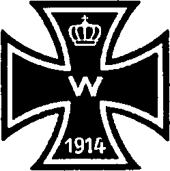

.. -*- encoding: utf-8 -*-

=======================
Die Juden im Weltkriege
=======================

.. pgheader::

.. meta::
    :PG.Id: 45808
    :PG.Title: Die Juden im Weltkriege
    :PG.Released: 2014-05-28
    :PG.Rights: Public Domain
    :PG.Producer: Norbert Langkau
    :PG.Producer: Enrico Segre
    :PG.Producer: the Online Distributed Proofreading Team at http://www.pgdp.net
    :PG.Credits: This file was produced from images generously made available by The Internet Archive.
    :DC.Creator: Felix \A. Theilhaber
    :DC.Title: Die Juden Im Weltkriege
    :DC.Language: de
    :DC.Created: 1916
    :coverpage: images/cover.jpg

.. role:: gesperrt
   :class: gesperrt

.. role:: autor
   :class: gesperrt large bold

.. style:: title
     :class: large bold center

.. .. suboptimal trick for top chapter page header; ..header not supported
..  by epubmaker 0.3.16
.. .. header:: |KapLin|
.. both :width: and :height: of image not honored in pdf, the 2nd wins

.. |nbs| unicode:: U+00A0  .. non-breaking space
   :trim:

.. |_| unicode:: U+00AD  .. soft hyphen
   :trim:

.. |--| unicode:: U+2014  .. em dash
   :trim:

.. for the index:

.. |nbs4| replace:: |nbs| |nbs| |nbs| |nbs|

.. |sdot| replace:: |nbs| |nbs| .

.. |sdot3| replace:: |sdot| |sdot| |sdot|

.. spaced ellisis and mdash

.. |dots| replace:: |nbs| .\ |nbs| .\ |nbs| .\

.. |_--_| replace:: |nbs| |--| |nbs|

.. |sterne| replace:: \* |nbs4| \* |nbs4| \*

.. clearpage::

.. mainmatter

.. container:: frontispiece

   [pg 1]

   .. class:: xx-large center

   |
   | DIE JUDEN
   | IM WELTKRIEGE
   |

   .. class:: center

   | **Mit besonderer Berücksichtigung**
   | **der Verhältnisse für Deutschland**

   .. class:: small center

   |
   | Von

   .. class:: center large

   | :autor:`Felix A. Theilhaber`

   .. vfill::

   .. class:: small center

   |
   |
   |
   |

   .. class:: large center

   | 1916
   |
   | |TitLin|
   |
   | WELTVERLAG |logo| BERLIN, UNTER DEN LINDEN 56

   .. |logo| image:: images/l.png
      :height: 0.6em
      :width: 0.6em
      :align: bottom
      :alt: *

[pg!2]

.. clearpage::

[pg 3]

|KapLinO| Inhalt.
=================

.. table::
    :hrules: none
    :width: 100%
    :widths: 20 2 1
    :aligns: left center right
    :vertical-aligns: top top bottom

    +------------------------------------------------+-------+----------+
    | `Vorwort`_                                     | Seite | [pg 5]_  |
    +------------------------------------------------+-------+----------+
    | `Einleitung`_                                  |       | [pg 7]_  |
    +------------------------------------------------+-------+----------+
    +------------------------------------------------+-------+----------+
    | `Der Krieg und die Juden`_                     |       | [pg 13]_ |
    +------------------------------------------------+-------+----------+
    |  |nbs4| `Die Stellung der deutschen Juden vor  |       |          |
    |  dem Kriege`_                                  |       | [pg 13]_ |
    +------------------------------------------------+-------+----------+
    |  |nbs4| `Die Juden im Kriege`_                 |       | [pg 28]_ |
    +------------------------------------------------+-------+----------+
    | `Juden im Ausland`_                            |       | [pg 36]_ |
    +------------------------------------------------+-------+----------+
    | `Die Lehren des Krieges`_                      |       | [pg 44]_ |
    +------------------------------------------------+-------+----------+
    | `Das Problem der Ostjuden`_                    |       | [pg 48]_ |
    +------------------------------------------------+-------+----------+
    +------------------------------------------------+-------+----------+
    | `Schluß`_                                      |       | [pg 58]_ |
    +------------------------------------------------+-------+----------+

.. _`Die Stellung der deutschen Juden vor dem Kriege` :
    `Die Stellung der deutschen Juden vor dem Krieg`_

 .. vfill::

.. class:: center noindent

|KapLin|

[pg!4]

.. clearpage

[pg 5]

|KapLinO| _`Vorwort`.
=====================

Die folgenden Ausführungen verdanken ihr Entstehen
freien Stunden an der Front in Kurland, wo ich dem unendlichen
Leid der Ostjuden auf Schritt und Tritt begegnete,
einer unterdrückten Menschenmasse, die menschlich unser
Interesse verdient, aber auch sprachlich, da sie den Deutschen
darin noch näher steht als die Vlamen.

Vor allem gilt die Schrift den Beziehungen der deutschen
Juden zu ihrer Umgebung. Die Verhetzung, welche
vor dem Krieg das Volk bald gegen Sozialdemokraten, Agrarier
und Zentrumsanhänger trieb, fehlte nicht gegenüber den
Juden. Aber jeder wirtschaftliche Haß, jede chauvinistische
nationale Abneigung wirkt auf die Dauer unfruchtbar und
schädlich.

.. class:: center

| |sterne|

Damit die gegenseitige Achtung auch nach dem Kriege
fortdauere und innerlich begründet wird, habe ich dargelegt,
daß das Wort eines großen Denkers nicht zu Unrecht besteht:
„Jedes Land hat die Juden, die es verdient“.
[pg 6]

„Wer die Luft, die ich atme, den Boden, auf dem ich
stehe und in dem meine Eltern bestattet sind, mir nehmen
will, ist mein Mörder\ |dots|\ “

.. vspace:: 2

So ungefähr wandte sich vor fünfzig Jahren Gabriel
Rießer an seine Widersacher. Möge uns, wenn wir in die Heimat
zurückkehren sollten, diese Sprache in alle Zukunft erspart
bleiben.

Möge mein Wort der Verständigung, der Aufklärung
und dem Frieden dienen!

   Herbst 1915.

   .. class:: right

   **Felix A. Theilhaber.**

.. vfill::

.. class:: center noindent

|KapLin|

[pg 7]

|KapLinO| _`Einleitung`.
========================

Die „Hilfe“ vom 2. September 1915 bringt einen Artikel
:gesperrt:`„Der Krieg und die russischen Juden“ von
Paul Barth`. Seine Worte mögen meine Auseinandersetzung
über das Problem „Judentum und Deutschtum“ einleiten.
Paul Barth schreibt:

„Was aber lauter als alles andere zum Himmel schreit,
das sind die Massenverbrechen, die die russische Militär-
und Zivilbürokratie tagtäglich an den „lieben Juden“ des
Zaren verübt. Wohin das russische Heer kommt, da ist die
erste kriegerische Leistung, daß die Juden ausgewiesen werden.
Im Februar dieses Jahres erließ der „Allgemeine Jüdische
Arbeiterbund Litauens, Polens und Rußlands“ einen
Aufruf an „die Kulturwelt“, der einigermaßen veranschaulichte,
welches Meer von Leiden hinter dem Worte „ausgewiesen“
steckt. Mit einer Frist von vierundzwanzig, oft
bloß von acht Stunden, hinausgetrieben in die Nacht und
die Kälte des russischen Winters, alle, auch Greise, Frauen
und Kinder; ohne Ziel, ohne Schutz in ein fast feindlich gesinntes
Land; rechtlos schon im Frieden, jetzt rechtloser
denn je. Unsere Ostpreußen sind gewiß tief zu beklagen,
aber sie zogen doch in ein freundlich gesinntes Land. Hunderttausend
ausgewiesene Juden sammelten sich damals
[pg 8]
hilflos in Warschau an, sehr viele, besonders Kinder, starben
auf der Landstraße. Wie glücklich verhältnismäßig diejenigen,
die ein Kosak erstochen hatte! Denn das ist nach
jenem Aufruf ein regelmäßiger Sport der Kosaken, der unbestraft
bleibt. Der Römer Seneca ereiferte sich darüber,
daß ein Mensch, der Gladiator, „zum Spiele und Scherze getötet
wird“. Der Gladiator jedoch konnte sich wehren, er
war bewaffnet, das Ganze war ein Kampf zweier geübter
Fechter. Der arme russische Jude aber kann sich nicht
wehren.

Und ich fürchte, das ist erst der Anfang. Allerdings
ein sehr großer Anfang. Denn Mitte Mai wurden die Gouvernements
Kurland, Kowno und ein Teil von Suwalki von
280000, also mehr als einer Viertelmillion Juden „evakuiert“,
wie der russische technische Ausdruck lautet. Neuerdings
wurde eine Million Juden aus den Gouvernements
Wilna, Grodno und Warschau vertrieben, d. |nbs| h. wirtschaftlich
vernichtet. Das tut die russische Regierung. Was wird
erst geschehen, wenn die russische „Volksseele“, besonders
die der „echt russischen Leute“, unruhig wird! Und sie
wird aufkochen, wenn Rußland weitere Niederlagen erleidet,
und sich in „Pogromen“ Luft machen, genau so, wie es
1905 und 1906 geschah. Was damals in Kertsch, Bialystok
und vielen anderen Städten vorging, das wird sich in ganz
Rußland wiederholen und wahrscheinlich mit viel größerer
Heftigkeit. Und die Polizei wird, wie damals, teils wohlwollend
zusehen, teils wohlwollend helfen. Damals war es
schließlich die erste, sehr liberale Duma, unter einem viel
besseren Stimmrecht als dem jetzigen gewählt, die den
Greueln ein Ende machte. Aber die Duma, die jetzt zusammengetreten
ist, wird für solche inneren Fragen keine Zeit
haben.

Was tun nun dabei die Juden der übrigen Welt, außerhalb
Rußlands? Im allgemeinen nichts,\ |_--_|\was überraschend,
[pg 9]
vielleicht auch ein bedauerliches Symptom ist. Wie
sehr sie auch die Kultur des Landes angenommen haben, in
dem sie wohnen, sie hegen doch alle die gleiche Pietät für
ihre Vergangenheit, die sie als starkes Band mit ihren russischen
Stammesgenossen vereinigt. Die deutschen Juden
freilich sind entschuldigt, sie :gesperrt:`können` nichts tun. Jeder
öffentliche Schritt ihrerseits würde den russischen Juden bloß
schaden. Diese würden daraufhin noch mehr verdächtigt
werden, über die Grenze hinaus nach dem Landesfeinde
zu schielen. In den Ländern des Vierverbandes sehen wir
nur eins: überall sind Juden unter den Kriegshetzern, gegen
die Zentralmächte, also für den Zarismus. In Frankreich
sind sehr viele Juden in den höchsten Stellen, die beständig
ihre Liebe zum Zarismus betätigen. In England haben
die Juden viel Einfluß in der höchsten Aristokratie, die
ganz besonders in der Hoffnung auf „die Dampfwalze“
schwelgte. Lord Rosebery, einer der einflußreichsten Aristokraten,
ist ja Schwiegersohn des Barons Meyer Rothschild.

In Italien finden wir unter den wildesten Kriegshetzern
jüdische Namen. Herr Nathan, der Bürgermeister von Rom,
hielt im Dezember 1914 als Freimaurer, als früherer Großmeister
der Logen des Großorients, im Theater Constanzi
in Rom eine schwungvolle Rede, in der er zum Kriege für
den Dreiverband, also für den Zaren, aufrief. Zwei bekannte
italienische Politiker jüdischer Herkunft, Barzilai
und Luzzatti, trieben ebenfalls zum Kriege.

Aber was tun die Juden in den neutralen Ländern?
Der einzige, der sich auf seine Herkunft und seine Gewissenspflicht
besinnt, scheint Georg Brandes in Kopenhagen,
wie sein Briefwechsel mit Clémenceau bewies. Andere sind
auf seiten des Vierverbandes. Die rumänische Zeitung „Adeverul“
(Wahrheit), die täglich gegen die Zentralmächte, also
für Rußland agitiert, war bis vor kurzem und ist wohl noch
in jüdischen Händen. Die übrigen tun gar nichts, nicht einmal
[pg 10]
die Sozialisten unter den Neutralen. Vor kurzem meldete
Reuter aus Neuyork, Samuel Gompers, der Vorsitzende der
American Federation of Labour, zweifellos jüdischer Herkunft,
habe auf eine Einladung zu einer Versammlung, die
gegen die amerikanische Kriegsbedarfsausfuhr protestieren
wollte, durchaus ablehnend geantwortet. Dunkel ist zwar
die Begründung seiner Ablehnung: „es gebe schrecklichere
Dinge als den Krieg, nämlich des Geburtsrechts (d. |nbs| h. wohl
des angeborenen Rechts), der Freiheit und der Gerechtigkeit
beraubt zu sein“. Dies alles sind ja die Leiden der russischen
Juden; aber Gompers lehnt ab, gegen die Unterstützung
ihrer Unterdrücker zu protestieren.

Wenn nun die Juden selbst so gänzlich passiv sind, so
müssen wir :gesperrt:`Nichtjuden` uns regen und sie aus ihrer
Resignation aufrütteln. Ich möchte nochmals betonen, daß
die Verfolgungen erst anfangen. Je weiter die verbündeten
Heere vorrücken, desto größer die Gefahr neuer Wutausbrüche.
Und schon, wie berichtet wird, sind die Juden teilweise konzentriert
in besondere Lager\ |_--_|\ sehr bequem für die Verfolger.
Das Volk wird einen Sündenbock suchen, auf den es die
Schuld der Niederlagen abwälze. Es wird die Regierung
schuldig finden, aber es kann wieder einen Minister geben,
wie denjenigen, der im Oktober 1905\ |_--_|\ nach jüdischen
Quellen\ |_--_|\ sagte: „Wir werden die Revolution im Blute der
Juden ersticken.“ Es folgten darauf die furchtbaren, zehn
Tage dauernden Oktobermorde. Tausend Juden wurden erschlagen,
achttausend wurden zu Krüppeln. Werte im Betrage
von 180 Millionen Mark wurden vernichtet, 300000
Juden flohen ins Ausland. (Vergl. „Allgemeine Zeitung des
Judentums“, 1910, S. |nbs| 577.)

Die deutschen Juden können, wie gesagt, unmittelbar
nichts tun, aber mittelbar sehr viel. Sie können die Juden
der :gesperrt:`nordamerikanischen` Union aufrufen, die für
russische Angelegenheiten doch sonst Interesse zeigen. Als
[pg 11]
der Beilisprozeß schwebte, haben diese beim russischen Gesandten
in Petersburg dagegen protestiert und später dem
zwar freigesprochenen, aber sehr geschädigten und gequälten
Beilis eine Farm geschenkt. Jetzt steht mehr als ein Menschenleben
auf dem Spiele. Was dem einen Beilis recht war,
ist allen russischen Juden billig. Die amerikanischen Juden
müßten laut und energisch ihre Stimme erheben für ihre
niedergetretenen russischen Stammesgenossen, täglich, so
oft als möglich, in den Zeitungen, in allgemeinen Versammlungen
der Juden und der Christen. Wenn erst die russische
Regierung weiß, daß man ihr Treiben beobachtet,
wird sie doch vielleicht stutzig werden und das Schlimmste
unterlassen, sie wird wenigstens nicht die Polizei zur schweigenden
Duldung der Morde und der Diebstähle anhalten,
sondern notgedrungen den Befehl zur Aufrechterhaltung der
Ordnung geben müssen. Nordamerika ist ja der künftige
Geldmarkt für Rußland, der einzige, wo es einst Anleihen
machen kann. Denn alle europäischen Staaten werden nach
dem Kriege selbst zu viel Schulden haben, um anderen leihen
zu können. Die Juden der Union aber sind eine starke
Kapitalmacht, besonders im Westen. Sie haben\ |_--_|\ nach
W. Sombart\ |_--_|\ eine herrschende oder wenigstens wichtige
Stellung im Getreidehandel, im Tabakhandel und im Baumwollhandel.
Auf allen drei Gebieten können sie den Russen
schaden. Vor allem aber können sie jede russische Anleihe
erschweren, vielleicht unmöglich machen. Damit müßten sie
drohen. Darauf wird selbst die zarische Regierung hören.

Und wenn die Proteste und Drohungen nichts helfen,
so werden sie doch wenigstens Zeugnis ablegen, daß in der
allgemeinen sittlichen Verwilderung es noch Menschen gegeben
hat, die die Unmenschlichkeiten der zarischen Regierung
als solche zu brandmarken gewagt haben.

Wenn aber gar nichts geschieht, dann wird ganz gewiß
sich das alte Sprichwort bewähren: „Wenn die Menschen
[pg 12]
schweigen, so reden die Steine“, freilich in diesem Falle nur
die Steine des Pogroms, die auf unschuldige, wehrlose
Opfer fallen werden.“

.. class:: center

| |sterne|

Wenn Barth sich auf die Einwirkung der amerikanischen
Juden verläßt, so fürchte ich, gibt er uns einen Wechsel
auf die Zukunft. Die amerikanischen Juden sind noch
nicht genügend organisiert, z. |nbs| T. auch als Vollblutyankees zu
sehr auf Seiten der Entente.

Ich glaube und werde es zu beweisen versuchen, daß
Deutschland allen Grund hat, jede antisemitische Regung
abzustreifen, den Juden im Inland die Gerechtigkeit, die
ihrer treuen Staatsbürgerschaft gebührt, widerfahren zu lassen,
den Juden in eroberten Gebieten jede Autonomie zu
gewähren und den Auswandernden im Orient allen Vorschub
für eine großzügige Kolonisation zu leisten.

Doch damit komme ich schon zur Voraussetzung jeder
Politik gegenüber den Juden: die Bewertung derselben als
zuverlässige und fähige Staatsbürger gegenüber ihren Heimatsländern,
und nicht zum mindesten in Deutschland!

.. vfill::

.. class:: center noindent

|KapLin|

[pg 13]

|KapLinO| _`Der Krieg und die Juden`.
=====================================

Der große Krieg hat infolge des grandiosen Kaiserwortes
„Ich kenne keine Parteien mehr“ den antisemitischen
Angriffen und Übergriffen vorläufig den Grund und Boden
entzogen. Trotzdem will das Judenproblem keineswegs von
der Bildfläche verschwinden. Im Gegenteil. Der Einmarsch
der deutschen Truppen in die polnischen und russischen Gebiete
hat mit einem Schlage die innerpolitische Unhaltbarkeit
des Schicksals, der nahezu sieben Millionen starken
jüdischen Bevölkerung Rußlands der ganzen Kulturwelt aufgetan.
Man wird nicht leugnen können, daß das jüdische
Problem beim Friedensschlusse sowohl von großem internationalem
Belang sein wird, als auch von hervorragender
Bedeutung für die :gesperrt:`deutsche Politik`.

_`Die Stellung der deutschen Juden vor dem Krieg`.
--------------------------------------------------

Die Judenfrage ist für Deutschland praktisch so wichtig,
daß es sich gewiß verlohnt, darauf einzugehen. Prüfen
wir zunächst einmal die Stellung der Juden Deutschlands
und ihren Einfluß in diesem Lande.

Die Mitte des verflossenen Jahrhunderts hat nicht nur
einen völligen Umsturz aller inner- und außen\ :gesperrt:`politischen`
Verhältnisse Deutschlands bedingt; die breiten
Volksmassen erschütterte ein :gesperrt:`sozialer` Umschwung.
Aus einem rein agrarischen Staate wuchs in wenigen Jahrzehnten
[pg 14]
eine gigantische Industrie heraus, welcher bald ein
weltenumspannender Handel die Wege bahnte. Die Technik
feierte rascher ihre Triumphe, als die Regierungsfürsorge
und die von Organisationen getragene Selbsthilfe der Interessengruppen
sich auf die Neukonstellationen einstellen
konnten. Dadurch gerieten die Arbeiter stellenweise in die
Gefahr, materiell und physisch ausgenutzt zu werden. Auf
dem Lande hatte sich einst ein ähnlicher Prozeß, wodurch
sich Latifundien bildeten, im Laufe der Jahrhunderte entwickelt.
Die industriellen und kommerziellen Großunternehmungen
aber kamen über Nacht. Erbarmungslos rang das
Großkapital den Stand der kleinen Leute nieder. Dieser
ökonomische Werdegang ging nicht ohne Gewalttat, ohne
Härten ab, die den Trägern den Haß des in seiner Existenz
erschütterten dritten Standes eintragen mußten.

Die Sozialdemokratie als die Zusammenfassung der
Proletarier ist das naturnotwendige Produkt dieser Entwicklung.
Der Antisemitismus ist die Konsequenz des Prozesses
insofern, als sich diese Bewegung gegen die sichtbarsten
Träger, gegen die Klasse von Menschen wandte,
welche am geschicktesten die Macht des Kapitals auszunutzen
wußten. Die erste Partei ist ein Versuch, der :gesperrt:`Sache`
selbst entgegenzutreten, die letztere kämpft gegen :gesperrt:`Personen`,
die nebenbei in ihrer religiösen und rassigen
Eigenart eine gute Zielscheibe boten.

Uns interessiert hier nicht, wie die Auswüchse des Kapitalismus
oder der Kapitalismus selbst zu bekämpfen ist.
Wir wollen nur der Frage nähertreten, wie der Antisemitismus
des weiteren zu erklären ist, welches die Bedeutung der
deutschen Judenheit gewesen ist, und ob wir anläßlich des
Krieges den Juden einen mehr oder minder günstigen Einfluß
auf die Wirtschaftsgestaltung Deutschlands einräumen
können, um dann später auf den Einfluß der deutschen Juden
und überhaupt auf den Krieg eingehen zu können.
[pg 15]

Bis in die sechziger Jahre des vorigen Jahrhunderts
strömte ein gut Teil der jüdischen Jugend Deutschlands nach
den Vereinigten Staaten von Amerika, Südafrika, England,
Frankreich etc. Teilweise war ihnen die volle Gewerbefreiheit
(wie z. |nbs| B. in Bayern bis 1864) vorenthalten gewesen.
Die siebziger Jahre, die berühmten Gründerzeiten, bringen
eine Hochflut von aus den Dörfern in die Städte strömenden
Juden. Die jüdischen jungen Leute wandern nicht mehr in
die Fremde, sondern wenden sich dem deutschen Handel,
der Industrie, den akademischen Berufen, und vor allem den
Großstädten zu. Das seit Jahrhunderten betätigte Wohnen
in den Städten, bedingt durch Eigenart, aber auch durch
das mittelalterliche Gesetz, das bis ins XIX. Jahrhundert hinein
Geltung hatte, läßt sie allmählich in die größeren Städte
abwandern, wo die Verdienstmöglichkeiten sich stetig vergrößern.
Dazu trägt auch die antisemitische Ostmarkenpolitik
bei, welche die Juden aus den Provinzen Posen, Ost-
und Westpreußen vertreibt. Der Druck der Hakatisten, der
wirtschaftliche und gesellschaftliche Boykott der evangelischen
Deutschen den Juden im Osten gegenüber, läßt ihre
Stellung zwischen Deutschtum und Polentum unhaltbar
werden. Dazu kommen elementare Ausbrüche der von den
Antisemiten bearbeiteten Volksschichten. Der „Ritualmord
von Konitz“ ist eins dieser bezeichnenden Ereignisse.
Fluchtartig verläßt der Jude diese Städte, deren Charakter
durch seine Anwesenheit noch ein deutscher war, und überläßt
den Platz den Polen.

.. vspace:: 2

Die neueren Schriften über das Ostmarkenproblem geben
sämtlich zu, daß die durch die staatliche und gesellschaftliche
antisemitische Politik bedingte Vertreibung der
Ostmarkenjuden ein bedeutsamer Mißgriff war, der sich nach
drei Seiten bemerkbar machte:

1. Für die Entwicklung dieser Städte, die durch den
[pg 16]
Verlust von Menschen, von Kapital und von unternehmungslustigen
und fähigen Elementen gehemmt wurde.

2. Für die deutsche Sache. Der Wegzug von ca. 150 bis
200000 Juden aus den bedrohten Provinzen hat die deutsche
Sache um so viel Anhänger ärmer gemacht.

3. Für den Staat. Der Jude der Ostmark (wie überhaupt
in ganz Deutschland) war ein zuverlässiger Staatsbürger,
auf den in jeder Zeit gerechnet werden konnte.

Organisationen über Organisationen erwuchsen aus dem
reichen Boden der Gebiete rechts der Elbe. Deutsche und
polnische Kleinbauern-Genossen\ |_|\schaften, Vereine der Gutsbesitzer
und Groß-Eigentümer, die zugleich die Zucker- und
Spiritusfabrikation besaßen, politische Organisationen beider
Sprachengemeinschaften, alle aber mit leicht antisemitischen
Tendenzen, die durch den in Berlin geborenen Antisemitismus
erst voll und ganz durchtränkt werden sollten.
Was dagegen der Jude an Organisation entgegenstellte, war
kaum der Rede wert. Er organisierte sich nicht wirtschaftlich,
sondern verzichtete darauf, sich in einen Kampf einzulassen,
in dem außer Regierung und Verwaltung auch die
breite Masse des Volkes gegen ihn Stellung nahm, und verschwand
in die Großstadt, wo er untertauchen konnte. [#]_

.. [#] Die oft zitierten jüdischen Vereine haben keinen wirtschaftlichen,
   sondern einen humanitären Charakter.

Dadurch ist die unnatürliche plötzliche Überschwemmung
der Hauptstädte mit Juden bedingt worden. Nicht nur
die Jungen und Fähigen kamen; viele, die sich nicht mehr
anzupassen wußten, schwemmte die Flut herein. Ältere Menschen,
die überall anstießen, weil sie in dem neuen
Beruf nicht mehr von der Pike auf dienen konnten.
Neben einer großen Menge von Begabten und Energischen
auch „Luftmenschen“, Bassermann'sche Gestalten, labile
Charaktere. Aber was das junge Blut anlangt, so kann
man leicht zeigen, daß es Deutschland zum Segen gereichte.
[pg 17]
Deutschland ist der große, kräftige und reiche Staat in
hohem Maße auch durch die Mitarbeit der :gesperrt:`Juden` geworden.

Bekannt ist deren Mitwirken an der finanziellen Entwicklung.
Die Finanzgrößen, die die deutsche :gesperrt:`Geldwirtschaft`
und die Großbanken schufen, waren zum großen
Teil Juden. Das Erstarken unserer finanziellen Kraft liegt in
der glücklichen Ausgestaltung unserer Finanzinstitute. Die
Banken sind nach Sombart eine jüdische Erfindung. Die
Barone Oppenheim sind die Gründer der ersten, der Darmstädter
Bank. Neben den Rothschild's ragen als Eisenbahnkönige
einige jüdische Häuser wie die in Bayern nobilitierten
Eichthal und die später in Preußen geadelten Fould's, später
Dr. Strousberg und der Baron Hirsch hervor. Das Bankhaus
Mendelsohn hat heute noch seine nahen Beziehungen zu den
maßgebenden Stellen des Reiches, und der Chef der Firma
Bleichröder ist der Öffentlichkeit populär geworden, weil er
Bismarck zu der hohen französischen Kriegsentschädigung
von 5 Milliarden in Gold zu bewegen wußte. Auch die modernen
Finanzgrößen, die Leiter unserer wichtigsten Institute,
zählen Juden an erster Stelle auf. Wir erinnern an
die von Cohn, von Wassermann, Fürstenberg, Speyer-Ellissen,
von Schwabach, Goldberger\ |dots|

Die Arnold, Berliner und Deutsch sind Namen, welche
in der neudeutschen Wirtschaftsgeschichte einen guten Klang
besitzen. Hagen-Köln (früher Levy geheißen) war wohl einer
der Männer, welcher in dem Aufsichtsrat der größten deutschen
Gesellschaften den mächtigsten Einfluß besessen hat.

Juden haben in Hamburg die :gesperrt:`Strumpfindustrie`,
in Fürth das :gesperrt:`Spiegelglas`, im posenschen die
:gesperrt:`Schnapsbrennerei` großgemacht. Wir treffen sie
auch als Großindustrielle in der :gesperrt:`Seiden`\ fabrikation.

Neben unseren vortrefflichen Geldinstituten haben uns
vor allem unsere großzügigen Wollfirmen die Kriegführung
[pg 18]
erleichtert. Der deutsche :gesperrt:`Woll- und Baumwollmarkt`
ist von Juden geschaffen und auf die Höhe gebracht
worden, die er heute einnimmt, wie wohl kein Kenner
der Verhältnisse bestreiten wird. Unter den vielen Tüchtigen
verdienen hier die Gebrüder Simon namentliche Erwähnung.

An den grandiosen Woll- und Baumwollhandel konnten
sich die zahlreichen, vielfach jüdischen, Textilfabriken anlehnen.
Die blühende deutsche :gesperrt:`Konfektion` ist quasi
eine jüdische Domäne.

Daneben erinnere ich an den Leipziger :gesperrt:`Rauch`\ markt.
Wer die berühmte Pelzmesse kennt, weiß, daß jüdischer Fleiß
und Erwerbsfreudigkeit hierin Deutschland eine erste Stelle
in der Welt schuf. Die großen „\ :gesperrt:`Felljuden`\ “, welche
unsere Lederindustrie mit ausbauten (z. |nbs| B. Adler-Oppenheimer),
und die :gesperrt:`Stiefelkönige` sind bekannt.

Den Neid aller Völker, den Stolz Deutschlands bedingte
unsere so rasch, fast über Nacht zu grandioser Größe
entwickelte :gesperrt:`Handelsflotte`, die auch in Kriegszeiten
dem Reiche ihre Dienste leiht. Der Schaffer der Hamburg-Amerika-Linie
aber ist der viel genannte :gesperrt:`Ballin`. Seine Bedeutung
für die Entwicklung Deutschlands wird einst die
Geschichte zu würdigen haben.

Der Vater der :gesperrt:`elektrochemischen` Industrie war
der jüngst verstorbene Rathenau, der Schöpfer der A.E.G.
Sombart behauptet, daß auch die Siemens und Halske-Werke
erst den Wettkampf um die Vormachtstellung der deutschen
Industrie in aller Welt aufnehmen konnten, als der
jüdische Direktor Berliner an leitende Stellung trat. Aber
nicht nur in friedlichen Zeiten bedang die A.E.G. Deutschlands
Ruhm und Größe. In unserm Kriege haben sie Bedeutendes
geleistet, wenn es jetzt auch noch nicht Zeit ist,
darauf näher einzugehen.

Viel geschmäht worden ist die Arbeit der Juden auf
dem Gebiete der :gesperrt:`Waffen-` und :gesperrt:`Munitionsfabriken`.
[pg 19]
Wie vereinzelte Sozialdemokraten die Wichtigkeit der
Kruppwerke und ihre vaterländische Rolle mißverstanden
und vor der breitesten Öffentlichkeit verunglimpften, so
wußte seinerzeit Ahlwardt den großen :gesperrt:`Löwe`\ konzern zu
verdächtigen. Aber die „Juden“flinten, die Maschinengewehre
und alle die Waffen, welche unsere Heeresleitung von diesen
Unternehmungen beziehen konnte, waren letzten Endes
nicht bedeutungslos. Der Nur-als-Krämer und Schacherer verschriene
Jude hat dem Reich zu Kriegsbeginn wertvolle
Stätten zur Verfügung stellen können: Angefangen von dem
reich überfüllten Wollmarkt, von den Handelsschiffen, welche
die Flotte stützten, bis zu den Fabriken, die direkt oder indirekt
dem Heere alle Mittel moderner Kriegsführung lieferten.

Wenn wir an die treue Mitarbeit jüdischer Firmen in
der :gesperrt:`Maschinentechnik` anknüpfen, dann dürfen wir
als deutsche Unternehmungen von Weltgeltung herausgreifen
die :gesperrt:`Orenstein und Koppel` A.G., (Kleinbahn- und
Baggerfabrikanten), die Mannheimer :gesperrt:`Ladenburgs`, die
Nürnberger :gesperrt:`Bings`. Selbst Erzschürfungen (Hirsch und
Beer-Sondheimer-Kupfer) werden von ihnen inauguriert.
Caesar Wollheim, v. Friedländer-Fould sind in ‚Kohle‘ bekannt.
Neben der Wichtigkeit des Materials und der Arbeitsstätten
ist es Geheimrat Haber, der durch die künstliche Gewinnung
des Stickstoffes erst die ganze deutsche Munitionserzeugung
gewährleistete, und der (nach Davis Trietschs Broschüre,
„Juden und Deutsche: Eine Sprach- und Interessen\ |_|\gemeinschaft“ [#]_)
jüdischen Eltern entstammt. Auf solche
Köpfe kann die deutsche :gesperrt:`chemische` Wissenschaft stolz
sein. Wie ja überhaupt die chemische Industrie Deutschlands
Größe in der Welt mitgeschaffen hat. (Es sei u. |nbs| a. auch des
jüdischen chemischen Industriellen :gesperrt:`Gans` gedacht, dessen
Sohn übrigens auf dem Gebiete der Luftschiffahrt und der
Ballontechnik Bedeutung hat.)

.. [#] Verlag R. Löwit, Wien 1915.

[pg 20]

Auch sonst wäre noch viel aufzuführen. Wir könnten
manches über andere Wirtschaftskomplexe hier anfügen, so
vom Tabakmarkt, von dem Sombart behauptet, daß Juden
die Tabakindustrie in Deutschland einführten. Ebenso wie
in der modernen Zigarren- und Zigarettenfabrikation halten
Juden den Wettbewerb als Uhren-, Sekt- und Schokolade-Fabrikanten
und als Getreideimporteure usw. usw.

Wir wollen nicht ermüden. Die Reichtümer, die einzelne
Juden sich erwarben, waren nicht unverdient. Sie sind bedingt
dadurch, daß Deutschlands Handel und Wandel zu der
Größe geführt wurde, die den Neid der fremden Völker erregte,
aber damit auch unserem Lande die Möglichkeit gab,
auch auf dem wirtschaftlichen Felde den allgewaltigen Kampf
gegen die Unmenge von Feinden so siegreich zu bestehen.

Auf dem Zeitungsgebiet zeigten die :gesperrt:`Mosse`, :gesperrt:`Ullstein`,
:gesperrt:`Sonnemann` (Frankfurter Zeitung) ihre Tatkraft
und schufen, trotzdem ihre Blätter als „verjudet“ verschrien
wurden, gewaltige Betriebe. :gesperrt:`S. Fischer` ist der bedeutendste
literarische Verleger, :gesperrt:`Reinhardt`, der :gesperrt:`Bühnentechniker`,
welcher dem modernen Theater reiche Impulse
verlieh, ist gleichfalls Jude. Als :gesperrt:`Antiquitätenhändler`,
:gesperrt:`Numismatiker`, als :gesperrt:`Sammler` jeder Art
haben die Juden den deutschen Ruf in der Welt mitbegründet.

Besonders stark angefeindet wurden sie in der Wissenschaft.
Um auf diesem Gebiete ihr Können einigermaßen zu
belegen, müßten wir allein ein dickes Buch schreiben. Aber
ein paar Beispiele dürfen wir wohl geben. So ist in der Medizin
die Lehre der :gesperrt:`sexuellen Krankheiten` durch
drei Juden\ |_--_|\ :gesperrt:`Neisser`, :gesperrt:`Ehrlich`, :gesperrt:`Wassermann`\ |_--_|\
in grandioser Weise gefördert worden. Neisser, der Entdecker
des Gonokokkus, Wassermann, der feinsinnige
Schaffer des luetischen Blutnachweises, und Ehrlich, welcher
eine moderne Waffe gegen die Syphilis schmiedete. Die :gesperrt:`Juristen`
[pg 21]
sprechen von den Begründern der deutschen
Rechtswissenschaft, von :gesperrt:`Staub` und :gesperrt:`Dernburg` mit all
der Hochachtung, die man diesen kaum vorenthalten dürfte.
Die :gesperrt:`Sprachwissenschaften` (die :gesperrt:`deutsche`
_`z. B.` vertreten durch :gesperrt:`Mauthner`) schätzen die jüdische Mitarbeit;
:gesperrt:`Statistik`, :gesperrt:`Nationalökonomie`, :gesperrt:`Chemie` [#]_
sind wie :gesperrt:`Literatur`, :gesperrt:`Musik` und andere kulturelle
Gebiete durch deutsche Juden befruchtet worden. Auf
:gesperrt:`Schachturnieren` (Lasker, Steinitz, Zuckertort, Tarrasch),
aber auch auf den olympischen Spielen, am Turf und
auf gefahrvollen Expeditionen bewährten sich Juden. :gesperrt:`Emin
Pascha` hieß einst Schnitzer, ein bedeutender Arabien-Forscher
war :gesperrt:`Glaser`, als einer der ersten wirkte in
deutschen westafrikanischen Schutzgebieten und erlag dort
der Malaria: Dr. :gesperrt:`Kaiser`.\ |dots|

.. [#] Der letzte Nobelpreis für Chemie fiel nach Deutschland. Sein
   Träger wurde eine allgemein anerkannte chemische Autorität; der Nachfolger
   Bayers in München, der Vorstand des dortigen staatlichen
   Laboratoriums, Geh. Rat Professor Willstätter.

.. vspace:: 2

Die antisemitische Bewegung, die vor dreißig Jahren
gegen die Juden entstand, ist dadurch erklärlich, daß von den
vielen hervorragenden Verdiensten deutscher Juden viel zu
wenig bekannt wurde.

Die politische Geschichte übergeht die Abstammung des
ersten deutschen Reichstagspräsidenten von Simson, der
seinem Könige mehrfach die Kaiserkrone antrug. Das damals
als Musterländle gepriesene Baden hatte einen nicht einmal
getauften Finanzminister: Ellinger.

Das waren einzelne Personen, die ihr Bestes für das
Werden des Reiches einsetzten. Schon in den 40er Jahren
waren es jüdische Dichter in der Sturm- und Drangperiode,
welche für Einheit und Fortschritt eintraten. Berthold Auerbach
und Andere, deren Namen heute vergessen sind, mußten
wegen ihrer Zugehörigkeit zu alldeutschen Burschenschaften
[pg 22]
hinter Kerkermauern dafür büßen, daß sie für ein
geeintes Deutschland agitierten.

Bedeutender zeigt sich aber die Mitwirkung jüdischer
Elemente bei der Ausgestaltung des deutschen :gesperrt:`politischen`
Lebens. Kein Volk der Welt hat ein so gut fundamentiertes
Parlament, in dem so überzeugungstreue Parteien
sitzen, die nicht nach Laune, nach persönlichen Vorteilen
stimmen, sondern die\ |_--_|\ oft viel zu sehr\ |_--_|\ nach theoretischen
Überlegungen und prinzipiellen Anschauungen den
Fragen nähertreten. Kein Abgeordnetenhaus hat sozialer
und menschlicher gearbeitet. An ihren Früchten kann man
am besten nicht nur die Bäume, sondern auch die Parlamente
erkennen. Unsere :gesperrt:`konservative` Partei feiert als
einen ihrer Mitbegründer Stahl; Lasker und Bamberger schufen
die :gesperrt:`liberale` Partei; Marx und Lassalle standen an
der Wiege der :gesperrt:`Sozialdemokratie`, die in Singer,
Haase, Bernstein und Frank mit ihre besten Führer fand.

Da wir noch keine Abhandlung über die jüdische Mitarbeit
an der Entwicklung Deutschlands in der neuesten Zeit
besitzen, so war es wohl nicht unangebracht, sie mit einigen
Beispielen zu belegen. Ähnlich wie :gesperrt:`Deutschland` in
der :gesperrt:`Welt`, so machten sich die :gesperrt:`Juden` in :gesperrt:`Deutschland`
„unliebsam bemerkbar“.

Der Umwelt erschienen einst die deutschen Waren als
„billig und schlecht“, die aufblühende deutsche Flotte war
den Engländern, die als handeltreibendes Seevolk ein Monopol
anstrebten, eine freche Konkurrenz, die deutsche Beteiligung
in der Weltpolitik kam den Engländern als Aufdringlichkeit
vor, selbst wenn sie noch so zurückhaltend war.

Dazu kamen noch historische Vorurteile, von welchen
z. |nbs| B. besonders die Franzosen nicht loskamen. Das Geschrei
der Gasse umnebelte selbst intelligente Engländer,
Franzosen, Italiener, Amerikaner, Rumänen, Russen. Auch
in der neutralen Welt gibt es leider tüchtige Menschen, die
[pg 23]
sich alle Fabeln über die Unkultur der Deutschen, über die
Eroberungssucht des Kaisers und seines Volkes zueigen
machten.

Geradeso hat man oft von den Juden gesprochen. Man
hat sie des Mangels an Kultur und an Redlichkeit geziehen
und all des Schlechten, was man den Deutschen heute nachsagt,
beschuldigt. Wollten sie beim Militär Karriere machen,
dann hinderte man sie daran; wenn daraufhin wieder Manche
keine sonderliche Lust am Dienste hatten, hielt man es ihnen
wieder vor. Wurden sie reich, dann erweckte das Eifersucht;
war irgendwo ein unbedeutender Jude, dann wurde daraus
der Schluß gezogen, daß der Jude überhaupt unfähig ist.
Es ist wirklich überraschend, wie ähnlich das Eintreten
Deutschlands in der großen Welt, und das Emporsteigen der
Juden in Deutschland von der Außenwelt gewertet werden.

.. vspace:: 2

Wir sehen es ja in unserer Zeit, wie nichts zu plump
ist, um geglaubt zu werden, wenn ein Volk neidisch ist. An
diesen Instinkt appellierten auch die Antisemiten. Der Jude,
der die deutsche Sozialdemokratie mitschuf, soll an den
Auswüchsen des Kapitalismus schuld sein, bloß weil findige
Köpfe, wie die Tietz, Wertheim, Jandorf, Israel, den Fabrikbetrieb,
das Maschinelle auch in den Kleinverkauf einführten
und das Warenhaus schufen. [#]_ Und wie einstmals die Handweber
die Fabriken stürmten und die Maschinen zertrümmerten,
so kämpften die kleinbürgerlichen Kaufleute und Handwerker
gegen die Riesenunternehmen, und verwechselten Person
und Sache. Wer diese modernen Erfinder haßte, wurde
Antisemit.

.. [#] Den „kleinen“ Mann haben ähnliche Entwicklungstendenzen in den
   meisten Fällen an die Wand gedrückt. Großbäckereien, Großschlächtereien,
   Wäschereien, Restaurationsbetriebe im großen, mit und ohne Filialen sind
   ähnliche Erscheinungen wie das Warenhaus, welche die selbständigen Handwerker
   und Kleinbetriebe in ihrer Existenz bedrohen.

Wie
[pg 24]
:gesperrt:`Deutschland in der Welt überall auf
Neider stieß, so fand auch der Jude in
Deutschland überall mißgünstige Seelen`.
Wie beschränkt diese waren, geht schon daraus hervor, daß
sie durch den Antisemitismus alle sozialen Fragen und Schäden
zu lösen glaubten.

Die antisemitische Literatur ist zwar recht armselig,
aber Deutschland hat das traurige Verdienst, diese „Wissenschaft“
in der Hauptsache geschaffen zu haben. Die anderen
Länder, die sich vielfach viel länger und viel ungenierter
in der Bedrückung ihrer lieben Juden überboten, bekamen
leider von Deutschland neue Impulse. Die Pamphlete der
Ahlwardts gingen in alle Welt und richteten außerhalb der
schwarz-weiß-roten Grenzpfähle, besonders auch in Österreich,
erschreckendes Unheil an. Noch vor kurzem hat der
große Staat Rußland den Juden einen Ritualmordprozeß
gemacht, nachdem vorher Österreich und Deutschland ihre
Ritualmordhetze gehabt hatten. Noch schmachtet in österreichischen
Kerkermauern ein wegen eines „Ritualmordes“,\ |_--_|\ wie alle 
Juristen beteuern, unschuldig\ |_--_|\ verurteilter armer
Jude: Leopold Hilsner. Keine Lüge war den Antisemiten zu
niedrig\ |_--_|\ man lese nur ihre Bücher\ |_--_|\ keiner ihrer Führer
zu\ |_--_|\ bedenkenfrei. Meist waren sie recht dunkle Ehrenmänner.
Aber das Gift, das sie verstreuten, trug dennoch
eine reiche Saat. Ein Mann beteiligte sich dabei, dessen
Schriften man nicht so ohne weiteres mit denen der anderen
vergleichen darf: Houston Stewart Chamberlain. Chamberlain
hat zwar neuerdings einiges Wasser in seinen Wein
gegossen. Er hat erklärt, seine früheren Behauptungen gegenüber
den deutschen Juden [#]_ nicht aufrecht zu erhalten.
[pg 25]
Chamberlain ist ein so maßloser Chauvinist, daß er selbst
Christus als Germanen reklamieren zu müssen glaubte. Er,
der noch vor kurzem allen Germanen, auch den Engländern,
Lob sang, hat nun ein Pamphlet losgelassen, für das es kaum
ein Wort der Entschuldigung gibt. Als geborener Engländer
durfte er nie und nimmer in der Weise das Nest beschmutzen,
dem er entstammte. Es gibt nichts Verächtlicheres, als wenn
Renegaten dem Volke, dem sie entstammen, in solcher Weise
seine Fehler vorhalten. Wenn sie, die die Schwächen am
besten kennen, sie zusammenstellen, übertreiben und daraus
ein Urteil fällen. Wenn wir nach der Methode Chamberlains
dozieren wollten, müßten wir zu dem Schlusse kommen: Alle
Engländer taugen nichts. Der Engländer ist so und so. Also
ist auch Houston Stewart Chamberlain\ |dots| So ähnlich wurde
nämlich nach H. St. Chamberlain über den semitischen Geist,
über den Juden im allgemeinen und im besonderen geurteilt,
selbst wenn er\ |_--_|\ weit mehr als Chamberlain, der die deutsche
Kultur erst seit einiger Zeit genossen hat\ |_--_|\ seit :gesperrt:`Jahrhunderten`
Anteil an allen Gütern deutschen Geisteslebens
genommen hatte.

.. [#] Das erklärt er :gesperrt:`heute`, nachdem die Rassenverhetzung den Juden das
   Leben auf Schritt und Tritt verekelt hat, nachdem seine voreilige Behauptung
   gegen die Juden die christliche Nächstenliebe bedingungslos aus
   Hunderttausenden zu Gunsten des Hasses gegen alle Anhänger des
   mosaischen Glaubens getilgt hat.

Nein, „der Jude“ in Deutschland war zum Teil tüchtig
und fähig, zum Teil faul und indolent. Er war auf der einen
Seite ein stiller Mann der Wissenschaft, der nach dem Muster
des genialen Spinoza, Marx und vieler anderer, die ohne nach
der Anerkennung der Öffentlichkeit zu lauern, in stillem
Kämmerlein ihre Werke schufen. [#]_ Es gab aber auch Eintagsgrößen,
die sich kaum von Charlatanen unterschieden.
Maezene und Volksfreunde hat es unter den Juden gegeben,
die ihr Vermögen dem Fortschritt hingaben, ohne daß es
die Menge erfuhr. Keine ideale Bewegung existiert, die nicht
[pg 26]
an den Juden reiche Förderer hat: für Frauenrechte, für
Kinderschutz, für die Waisen, Arbeitslosen, Blinden etc.,
die Bestrebungen für die Abstinenz, für Friedenspropaganda,
für Vegetarismus, für alte Bühnenkünstler, für alle Künste,\ |_--_|\ der 
Jude hat seine Person, sein Ansehen und nicht zum
mindesten sein Geld jederzeit guten und idealen Zwecken zur
Verfügung gestellt.

.. [#] So hat der auf dem Felde der Ehre gefallene jugendliche Komponist,
   Kriegsfreiwilliger Walter :gesperrt:`Asch`, wie eine Münchener Zeitung meldet, in
   allzu großer Bescheidenheit als seinen letzten Willen hinterlassen, daß
   seine Werke nicht gedruckt werden dürfen.

Der Jude, der so sehr für jeden sozialen Fortschritt zu
haben war, der auf Grund alter historischer Gewohnheiten
für den Ruhetag in der Arbeitswoche, für das Angestelltenrecht
etc. eintrat, der sich stets für Freiheit einsetzte, wurde
den Massen als Ausbeuter schlimmster Sorte, als soziales
Hemmnis hingestellt. Vergeblich sein Eintreten für alle demokratischen
Ideale, für individuelle Freiheit, für internationale
Verständigung. Wie der wirtschaftliche Neid nicht
nur den Blick trübt, sondern fast blind macht, sehen wir jetzt
ja an den Engländern. Diese Gewaltsmacht, die so oft ganz
real die Verhältnisse beurteilte, schilt die Deutschen Barbaren,
während sie ihr Heer zusammensetzt und sich verbündet
mit Hunderttausenden von Negern, Indiern, Zuaven,
Tscherkessen, Kosaken, Kalmücken und allen schiffbrüchigen
Existenzen der neuen und alten Welt. Dieses für Geld geworbene
Analphabetengesindel soll das Vorkämpfertum der Kultur
sein! Die Engländer, die am längsten den Sklavenhandel
geduldet, nein gezüchtet hatten, die in Südafrika die Burenfrauen
mordeten, in Ägypten die Verträge brachen und die
Indier verhungern ließen, sind mit Recht als Heuchler an den
Pranger gestellt worden. Bei den Franzosen gelten :gesperrt:`alle`
Deutschen als Boches, als Verbrecher und als Schweine.\ |dots|
Dieser Weltkrieg, an dem 10 Millionen Juden beteiligt sind
und schwere Opfer bringen, darf nicht vorübergehen, ohne
daß das von Antisemiten getragene absprechende Urteil über
sie in Acht und Bann getan wird. Ein Urteil, das ebenso
unberechtigt ist wie das der Entente-Mächte über die Deutschen.
[pg 27]
Nicht nur, weil ein prächtiges Kaiserwort das gehässige
Treiben der Rassen- und Religionsschnüffler für die
Dauer des Krieges unterband, sondern weil Deutschland und
die Welt einsehen muß, daß die Behauptung der Minderwertigkeit
Andersgearteter allzuoft nur eine billige, überall
gehandhabte Waffe des :gesperrt:`Neides` ist.

.. vspace:: 2

Und so unterstreichen wir nochmals die Tatsache:

.. vspace:: 2

Daß der Jude am Gemeinwohl, am Fortschritt, an der
Entwicklung Deutschlands freudig teilgenommen hat, kann
kein objektiv denkender Mensch bestreiten. Ob er als Bürgermeister
von Posen [#]_ oder als Stadtrat von Berlin [#]_ oder
Frankfurt, oder im Ehrenamt, oder als Wähler einer Gemeinde
seine Pflicht erfüllen konnte,\ |_--_|\ als der Abkömmling
einer alten Kulturrasse interessierte ihn alles öffentliche
Leben. Die Städte, in denen die Juden seit langem wohnen
und eine gewichtige Stimme haben, sind nicht schlecht damit
gefahren. Das reiche Frankfurt blüht, Nürnberg, Fürth entwickeln
sich überaus rasch, Hamburg gedeiht.

Die neueste Wissenschaft hat den Juden mehr Gerechtigkeit
widerfahren lassen. :gesperrt:`Sombarts` Arbeiten zeigten die
Bedeutung der Juden. Es ist ziemlich gleichgültig, ob die
Juden Handel und Wandel in die Orte bringen, wohin sie
kommen, oder ob sie ihn mit zur Blüte bringen. Jedenfalls
ist dort Entwicklung, wo sie unbedrückt leben können.

.. [#] Witting (Witkowski).

.. [#] \z. |nbs| B. Cassel.

.. vspace:: 2

Außerdem hat eine ziemlich starke Verschmelzung des
Adels mit der deutsch-jüdischen Geldaristokratie, die übrigens
auch ca. 100 geadelte Familien zählt, stattgefunden.
Ebenso ist in den besten bürgerlichen Kreisen vielfach eine
Vermischung eingetreten. Solchen Familien entstammte z. |nbs| B.
Dernburg, der bekannte Kolonialpolitiker, Heyse, der Schriftsteller,
[pg 28]
der Admiral Bendemann, andere führende Männer
sind mit Jüdinnen verheiratet. [#]_

.. [#] So sind z. |nbs| B. die Nachkommen der bekannten jüdischen Gelddynastien
   Gumpert und Heine aus Hamburg mit dem deutschen und internationalen
   Hochadel verschwägert, ebenso wie die als Rennstallbesitzer geschätzten
   v. Oppenheimer aus Köln, v. Weinberg aus Frankfurt, die Bernstein-Becker
   aus Königsberg, v. Hirsch-Gereuth aus München. Ursprünglich jüdisch
   waren folgende nobilitierte Familien: v. Ukro, v. Oppenfeld, _`v. Renard,`
   v. Moßner, v. _`Schwanenfeld`, v. Halle, v. Löwenthal u. |nbs| a.

_`Die Juden im Kriege`.
-----------------------

Obwohl nachweislich viele jüdische Burschenschafter für
das schwarz-rot-goldene Band gekämpft und gelitten hatten,
obwohl in der Mitte des 19. Jahrhunderts einzelne jüdische
Burschenschafter an der Spitze der Verbindungen standen,
erklärte 50 Jahre später der Weidhofener Verband der
deutsch-österreichischen Burschenschaften alle Juden insgesamt
für jeder Ehre bar und verweigerte jedem Juden die
Satisfaktion, also auch denen, die bis kurz vorher als alte
Herren dem Verband angehört hatten. Dieselbe Überhebung,
die ein anderer großer studentischer Verband zeigte, als er
Naumann und andere höchst ehrenwerte deutsche Politiker
wegen ‚sozialistischer‘ Tendenzen ausstieß, veranlaßte
geistesverwandte junge Leute, die Juden in Bausch und
Bogen zu verdammen. Semper aliquid haeret. Noch hinkt
die Verleumdung, die Beschmutzung, die Verdächtigung uns
nach. Auch dem jüdischen Soldaten.

Der Jude hat sich als Soldat bewährt. In allen Kämpfen
der letzten Jahre haben sich Juden bewährt. Die Bulgaren
und Türken haben sie im vorletzten Krieg vielfach gerühmt.
Selbst im antisemitischen Rumänien ist ein jüdischer Oberst
(Brociner), der sich im Krieg 1878 auszeichnete, der Kommandeur
der Leibgarde und des Königl. Schlosses. In Österreich
sind Juden kommandierende Generale, in Italien war
[pg 29]
der frühere Kriegsminister Ottolenghi Jude und schon Napoleon
hatte jüdische Heerführer.

In den deutschen Freiheitskämpfen gab es viele freiwillige
jüdische Vaterlandsverteidiger, einige erhielten auch
den Offiziersrang. Auch später konnten Juden, hauptsächlich
anno 1870, Offiziere werden; aktive Offiziere standen
nur in Bayern, ungetaufte Juden waren hier hauptsächlich
Reserveoffiziere und aktive Militärärzte, ein Jude brachte es
einige Jahre vor dem Kriege bis zum Major. [#]_

.. [#] In Bayern gibt es jetzt aktive jüdische Majore und Oberstabsärzte,
   erstere etwa fünf, von letzteren, soviel bekannt wurde, sieben. In Österreich
   haben sich Juden als Generale ausgezeichnet; aktive Offiziere gibt
   es einige Hundert. Nach Bloch's „Österreichische Israel. Wochenschrift“
   haben sehr viele während des jetzigen Krieges ein glänzendes Avancement
   erfahren. Eine soeben erschienene Broschüre Ludwig Geiger's „Deutsche
   Juden und der Krieg“, die mir bei der Korrektur vorliegt, bringt genauere
   Zahlen über die Beteiligung der deutschen Juden an den Kriegen des
   XIX. Jahrhunderts. Hardenberg anerkannte danach schon am 4. 1. 1815:
   „Die jungen Männer jüdischen Glaubens sind die Waffengefährten ihrer
   Mitbürger gewesen, und wir haben unter ihnen Beispiele des wahren Heldenmutes
   und der rühmlichen Verachtung der Todesgefahr aufzuweisen, sowie
   die Einwohner Berlins, namentlich auch die Frauen, in Opfern jeder Art
   sich den Christen angeschlossen haben.“

   Eine Denkschrift der Regierung Preußens vom Jahre 1847 ermittelte
   das Verhalten der Juden als Soldaten und stellte fest, daß die Juden in den
   Freiheitskriegen wie im Frieden den übrigen Truppen nicht nachstanden.

Im Kriege stellten sich nun erfreulicherweise viele Kommandeure
auf den Standpunkt, den einmal der leider auf dem
Felde gefallene Hauptmann von Treskow also präzisierte:
„Wenn wir die Juden prinzipiell nicht befördern, dürften
wir ihre Dienste auch nicht in Anspruch nehmen“. Nach
Schätzungen werden jetzt über 900 Juden als Offiziere, ungerechnet
die Militärärzte, im Felde stehen. Viele sind wegen
besonderer Tüchtigkeit befördert worden, das „Hamburger
Israel. Familienblatt“ stellte schon über 20 Träger des Eisernen
Kreuzes I. Klasse fest (z. |nbs| B. der Flieger Frankl, der
Reichstagsabgeordnete Haas), darunter waren alle Waffengattungen
vertreten. Auch bei der Marine und in den
[pg 30]
Schutztruppen haben sie sich ausgezeichnet. Nach dem
Kriege werden die Ziffern insgesamt zur Verfügung stehen.
Das in Breslau erscheinende „Jüdische Volksblatt“ hat die
Namen veröffentlicht, die bestimmt dem Judentum angehören.
Darnach haben bis zum Herbst 1915 knapp 5000 Juden
(also fast 1% der gesamten deutschen Judenheit!) das
Eiserne Kreuz erhalten, von über 3000 Juden konnte namentlich
festgestellt werden, daß sie den Heldentod fürs Vaterland
gefunden. Leider kann diese wöchentliche Zusammenstellung
nicht den Anspruch auf Vollständigkeit erheben.
Da die jüdische Jugend, soweit sie nicht gedient hatte, gleich
zu Beginn des Feldzuges freiwillig in großer Zahl (|--| |nbs| es
wäre sehr interessant, wenn die Heeresverwaltung diese
Ziffer veröffentlichen würde |nbs| |--|) sich stellte, sind die Verluste
sehr stark. [#]_ In allen jüdischen Jugendvereinen wird
diese Tatsache festgestellt. So ist z. |nbs| B. in der jüdischen Turnerschaft
eine Kriegssterblichkeit, die sich in den einzelnen
Untervereinen bis 33% der _`Mannschaften` (wie z. |nbs| B. bei dem
Ruderklub ‚Ivria‘) stellt. Die meisten Turn- und Sportvereine
der jüdischen Turnerschaft mußten zu Beginn des Krieges
ihren Betrieb aufgeben, da alle Mitglieder zu den Fahnen
eilten.

.. [#] Die „Leipziger Neuesten Nachrichten“ konstatierten, daß die in
   Deutschland lebenden Juden, gleichviel welcher Staatsangehörigkeit, in
   großer Zahl freiwillig zu den Fahnen eilten.

Die Mitglieder der jüdischen studentischen Verbindungen
stellten gleichfalls viele Freiwillige. Von den 2000 Mitgliedern
des K. C. (Kartellkonvent) und des K. J. V. (Kartell
jüdischer Verbindungen) rückten fast alle aus; ein Drittel
davon als Kriegsfreiwillige. Sehr zahlreich war auch die
Beteiligung freiwilliger jüdischer Ärzte. Nach einer Statistik
beträgt die Verlustliste bei den jüdischen Ärzten schon
über Hundert. Auch der jüdische Arzt hat an der Front
und im Seuchenlazarett seinen Posten ausgefüllt.

[pg 31]

Der tapfere jüdische Soldat und Offizier verschwindet
oft in der Menge. So glaubte man z. |nbs| B. allgemein nicht,
daß der einzige Soldat, der bei meinem Regiment das Eiserne
Kreuz I. Klasse im Jahre 1914 besaß, ein Jude war (der
später als Leutnant gefallene Gottfried Sender, Lehrer an
einer jüdischen Mittelschule, welcher es im Frieden knapp
bis zum Gefreiten bringen konnte). Vielfach ist aber die
Tüchtigkeit des jüdischen Vorgesetzten und Soldaten von
hohen Offizieren anerkannt worden. Exempla docent. Die
überaus große Zahl von Beförderungen, Dekorationen etc.,
über die sich jeder, namentlich z. |nbs| B. im „Hamburger Israelitischen
Familienblatt“ informieren kann, gibt die beste Gewähr.
Der österreichische Thronfolger hat oftmals Gelegenheit
genommen, sich dahin auszusprechen, daß der persönliche
Mut und die Zuverlässigkeit des jüdischen Soldaten
durch diesen Krieg aufs neue bewiesen wurden. [#]_

.. [#] Überall ist die Tapferkeit der Juden anerkannt worden.

   Prinz Fuad, der Flügeladjutant des türkischen Sultans, hat dem
   offiziellen ungarischen Pressevertreter folgende Erklärung abgegeben (in
   der deutschen Presse im Jüd. Echo, München, Nr. 27, 1915, wiedergegeben):

   „Die jüdische Legion, welche auf den Dardanellen operiert, verrichtet
   wahre Wunder. Der Kommandant der Legion, ein türkischer Jude, bekam
   den Hauptmannstitel und eine Auszeichnung. In den übrigen Militärteilen
   kämpfen die Juden mit andern zusammen ausgezeichnet. Die türkischen
   Militärbehörden machen daher keinen Unterschied zwischen jüdischen und
   nichtjüdischen Soldaten. Das Gleiche kann hinsichtlich der jüdischen Zivilbevölkerung
   gesagt werden, welche im jetzigen schweren Moment opferwillig
   dem Lande hilft, soviel sie nur vermag. Die jüdischen Bestrebungen
   in Palästina sind gut bekannt; niemand zweifelt an dem Patriotismus
   der türkischen Juden“.

   Und Gustav Hervé sagt über die viel geschmähten russischen Juden\ |_--_|\
   welche ein eignes Regiment gebildet hatten und in den erbitterten
   Frühjahrskämpfen bei Arras fielen\ |_--_|\ bei Gelegenheit der Veröffentlichung
   von Briefen gefallener Juden der jüdischen Fremdenlegion:

   „Held Litwak\ |_--_|\ du, dessen herrlicher Brief, geschrieben am Tag
   deines ruhmvollen Todes bei Carency an der Seite von 2000 Mitjuden, ich
   unlängst abgedruckt habe, vergib diesen armen Sergeanten, die euch
   monatelang als schmutzige Judenbuben und ähnlich beschimpft haben\ |_--_|\
   euch, die ohne dazu verpflichtet zu sein, in einem Augenblick edler
   Begeisterung euer Blut großmütig an Frankreich dahingegeben habt, das
   in euren Augen das Sinnbild aller Freiheit und sittlichen Größe war.“\ |dots|
   Und das beste Zeichen, wie sehr die Juden freiwillig für die Freiheit _`zu`
   kämpfen wissen, daß gerade die Anführer der polnischen Legionisten fast
   durchwegs Juden sind: Nach dem Jüd. Echo (Nr. 31, 1914, München) ist
   der Vorsitzende des Polnischen Nationalen Hauptkomités und der Legionen
   ein Jude namens Mosche Scherer und ebenso eine ganze Anzahl von Führern
   der Legion.

Ebenso wie der sozialdemokratische wurde auch der
jüdische Soldat endlich einmal von den Meisten vorurteilsfrei
betrachtet und bewertet. Natürlich gibt es auch Fälle,
[pg 32]
wo sich Vorgesetzte noch nicht in den Gedanken der Gleichwertigkeit
„solcher Elemente“ hineinleben konnten.

Die ungeheure sozialdemokratische Begeisterung ist
nicht zuletzt das Produkt der so oft geschmähten „inter“-nationalen
Denkweise jüdischer Führer, mit der man früher
alles Unrecht gegen Juden deckte und erklärte. Die Führer
haben ihren Patriotismus nicht nur durch billige Phrasen
dokumentiert, sie sind nicht wie andere Sozialistenführer à la
Vandervelde als Wanderredner durch die Lande gefahren, um
die Menschen aufzuwiegeln, haben à la Hervé billige blutrünstige
Artikel geschrieben oder sich als Leutnants, wie
D'Annunzio, zu Hause wichtig gemacht. Der Jude :gesperrt:`Ludwig
Frank` [#]_, _`vielleicht` der fähigste Kopf in der sozialdemokratischen
Partei, trat als einfacher Soldat in Reih und Glied
und fiel\ |_--_|\ wie er es wünschte\ |_--_|\ als ein einfaches, aber
schönes Beispiel treuer Vaterlandsliebe.

.. [#] Der bekannte Genosse Davidsohn „nur“ zweimal verwundet, nunmehr
   Offizierstellvertreter.

Aber nun kam, was nicht kommen durfte. Man hat in
vielen Zeitungen über den Mannheimer, über den Rechtsanwalt,
über den Sozialdemokraten Frank geschrieben. Man hat
bewiesen, daß ein Sozialdemokrat patriotisch sein könne.
Daß er aber ein Jude war, diese Tatsache wurde nach Möglichkeit
verschwiegen.\ |_--_|\ Nicht zum Beweis der Tapferkeit
und der Vaterlandsliebe wollen wir Frank als Juden registrieren.
Es liegt eigentlich eine unglaubliche Verworfenheit
des Charakters vor, wenn jemand von einer kulturell so
[pg 33]
hochstehenden Rasse wie der jüdischen, von der Tausende
im öffentlichen Leben wirken, welche alle Kulturstätten deutscher
und anderer Bildung genossen haben, annehmen könnte,
daß Mannesehre und Würde bei ihnen nicht zu finden wäre.

Daß man bei allen Nachrufen aber sichtlich vergessen
wollte, zu erwähnen, daß der erste deutsche Volksführer,
welcher mit seinem Tode die Treue zur Heimat und zum
Staate besiegelte, ein Jude war, ist keine erfreuliche Erscheinung. [#]_
Ebensowenig wie die Tatsache, daß die Dichter
[pg 34]
des großen Krieges, die zuerst verwendet wurden und
starben, Juden waren. Wir nennen nur :gesperrt:`Zuckermann`,
der das wundersame österreichische Reiterlied empfand, und
:gesperrt:`Heymann`, den jungen Königsberger Lyriker, sowie den
Schlesier Georg :gesperrt:`Hecht`. Man hat so oft über die billige
Poesie, wie sie Literaten hinterm Schreibtisch gewinnsüchtig
betreiben, gespottet. Zuckermann, Heymann, Georg Hecht.
:gesperrt:`Ich kannte die glühende Begeisterung, die
sie mit dem Leben zahlten.`

.. [#] Dagegen unterstreichen z. |nbs| B. die deutsch völkischen Blätter hämisch,
   daß Haase, welcher den verunglückten Aufruf veranlaßte, :gesperrt:`Jude` sei, was
   man zu Kriegsbeginn, als er noch in minder unsympathischem Fahrwasser
   segelte, sorgsam unterließ, bei ihm zu erwähnen.

   Eine typische Todesanzeige für einen aktiven jüdischen Offizier mag
   hier folgen:

   .. vspace:: 2

   .. class:: center

   |Rahmen1| |nbs| |Verdienstkreuz| |nbs| |Rahmen1|

   Gestern Abend um ½9 Uhr verschied in der Medizinischen
   Klinik des Bürgerspitals zu Straßburg

   .. role:: gross
      :class: large bold

   .. role:: grosser
      :class: x-large bold

   .. role:: amgrossten
      :class: xx-large bold

   :grosser:`Herr Major` \ \ :amgrossten:`Max Hollerbaum`

   .. class:: bold

   Kommandeur des B. Landsturm-Infanterie-Bataillons Passau II
   Ritter d. Eisernen Kreuzes, d. K. B. Militär-Verdienstordens usw.

   Das Bataillon steht in tiefer Trauer an der Bahre seines
   ersten Kommandeurs.

   Durch und durch Soldat, ein vornehmer, ritterlicher, zuverlässiger
   Charakter, durch Willenskraft und warmherziges Wohlwollen gleichmäßig
   ausgezeichnet, war er uns allen vorbildlich auch durch den
   Heroismus, den er im Kampfe gegen ein langwieriges, schweres Leiden
   bis zuletzt bewahrt hat. Es war ihm nicht vergönnt, wie an dem
   Kriege um die Gründung des Reichs so an dem um seine Behauptung
   bis zum ehrenvollen Abschluß teilzunehmen. Aber er hat Treue bis zum
   Tode gehalten, und sein Gedächtnis wird in hohen Ehren bleiben.

   Am 27. September 1915.

   :gross:`Für das Landsturm-Infanterie-Bataillon Passau II`

      | I. V.: **Hauptmann Freiherr von Pechmann.**

   .. class:: center

   |Rahmen|

   .. vspace:: 2

   Anschließend mag noch bemerkt werden, daß Major Hollerbaum
   nicht der einzige aktive jüdische Offizier in der bayerischen Armee war.
   Es gab und gibt noch eine Anzahl solcher. Nachstehend seien nur einige
   namentlich genannt: Der alte bayerische Kürassiergeneral Carl Ritter
   \v. Obermayer, Major Isidor Marx (Vater) und Major Maximilian Marx (Sohn),
   die Majore Orfenau, Friedmann, Henle u. |nbs| a. Außerdem gab und gibt es viele
   jüdische aktive Sanitätsoffiziere, Militärbeamte und auch untere Chargen.

Wie aber war die Haltung der jüdischen Bevölkerung
vor dem Ausbruch des Krieges? Die Juden haben sich in
allem überaus würdig benommen. Daß sie als Kaufleute und
Bankiers usw. nicht wie die Militärs beständig sich um die
Militärangelegenheiten bekümmerten, ist selbstverständlich.
Das berühmte „jüdische :gesperrt:`internationale` Großkapital“,
von dem soviel gefabelt wird, ist nie in Aktion getreten.
Die jüdischen Bankiers und die jüdischen Kaufleute benahmen
sich nicht anders wie die andern Schichten der Bevölkerung.
Ruhig und ernst, wie es der Situation entsprach, als
ihre Söhne entweder freiwillig oder als Militärpflichtige hinauszogen.
Reiche Gaben und Spenden flossen allen Instituten
von ihnen zu. Und was in der Heimat geleistet werden
konnte, wurde getan. Männer wie Ballin, Rathenau, Riesser
ruhten im Kriege nicht. Es ist noch nicht die Zeit, ihrer Verdienste
für die Volksernährung, für die Munitionsergänzung
_`und anderer Dinge zu gedenken.` [#]_

.. [#] Otto v. Gottberg, die offiziöse Feder unseres Kriegsministeriums,
   schreibt in einem Artikel „D. K. R. A.“ über Rathenau: „Er kam ohne
   Ruf und Amt, ein Deutscher in Sorge um das Vaterland. Wie wenige
   ein Kenner unserer Wirtschaft, fühlte Dr. Walter Rathenau, daß Deutschland
   einen längeren Krieg siegreich nur dann überstehen könne, wenn der
   Staat ohne Säumen zu organisiertem Sammeln, Sparen und Mehren der für
   die Kriegführung nötigen Stoffe schritt. Der Kriegsminister sah den Mann,
   den er gesucht hatte. Sankt Bureaukratius schlug wohl unter Protest
   die Hände über dem Kopf zusammen, als der General den Zivilisten, Doktor
   und Ingenieur mit höflicher Geste beim Kragen nahm und im Allerheiligsten
   der Heeresverwaltung in einen Stuhl setzte mit dem Auftrag,
   die Kriegs-Rohstoff-Abteilung _`ins Leben zu rufen.`\ “

   Die Art, wie Rathenau die Aufgabe in achtmonatlichem Wirken löste,
   sichert ihm einen Ehrenplatz _`in der Geschichte des Wirtschaftskrieges.`
   [pg 35]

Die deutschen Juden hatten schon in Friedenszeiten eine
zu geringe Vermehrung. Zu viele blieben aus wirtschaftlichen
Gründen oder aus Laune Junggesellen; die vielen Spätehen
der akademischen Kreise und der Kaufleute bedingten einen
hohen Prozentsatz kinderloser Ehen. Die, die Kinder haben,
begnügen sich mit zweien. Auf die deutsche Judenheit,
welche eine geringere Geburtenziffer als die Franzosen
hat, wird der Krieg eine unheilvolle Bedeutung haben. Er
rächt die Beschränkung der Kinderzahl.

Die durch Taufe und Mischehe und Kinderlosigkeit geschwächte
deutsche Judenheit weiß, daß dieses elementare
Ereignis ihre Reihen noch mehr lichten wird. Alte Familien
werden durch den Krieg erlöschen, die deutsche Judenheit
wird unendlich geschwächt und in ihrer Existenz erschüttert
aus dem Kriege hervorgehen.

Die jüdische Jugend zahlte gern die Teilnahme an
der deutschen Kulturgemeinschaft mit dem Tode.

.. vfill::

.. class:: center noindent

|KapLin|

[pg 36]

|KapLinO| _`Juden im Ausland`.
==============================

Italien, Frankreich, England sind judenarm. Italien
hat nur 40000, Frankreich 120000, England nicht ganz
300000, also alle drei Länder zusammen nicht viel mehr als
Preußen. In der englischen Regierung saß vor 35 Jahren
ein bedeutender Jude, Lord Beaconsfield, der mit Bismarck
eine Verständigung der beiden Länder herbeiführte. Heute
hat im britischen Ministerium nur Lord Samuel ein Portefeuille,
das des Postministers, der nur in seinen Angelegenheiten
eine Stimme hat.

In Italien ist der bekannte Sonnino der Sohn eines getauften
italienischen Juden und einer englischen Christin.
Außerdem ist in Italien der Finanzminister Luzzatti Jude,
der sich ursprünglich gegen den Krieg aussprach. [#]_ Das
judenreinste Kabinett Rußlands trägt die Hauptverantwortung
für diesen Krieg. Das Land, in welchem die Juden am
wenigsten zu sagen haben, hat am stärksten zum Kampf gedrängt.

.. [#] Die Abkunft Barzilais' ist übrigens nicht sicher auf Juden zurückzuführen.

In England lag die Entscheidung ausschließlich bei
wenigen Nichtjuden. Bedeutende englische Juden hatten
sich gerade in den letzten Jahren für eine gegenseitige Annäherung
Deutschlands und Englands bemüht, weil sie instinktiv
_`die Entfremdung der Länder bemerkten.` [#]_ Als der
[pg 37]
Krieg begann, legten Sir Cassel und Sir Speyer ihre Würden
nieder.

.. [#] Dafür hat Ernst Cassel Millionen gespendet, die er dem Kaiser
   übermittelte; der einzige Engländer, der sich die Freundschaft der beiden
   Länder etwas kosten ließ und sich ernsthaft darum bemühte.

In Frankreich war das Kabinett wie in Rußland und
Serbien „judenrein“. Die Juden an der Pariser Börse haben
wahrlich keinen Krieg inszeniert. Als der Krieg aber ein
fait accompli geworden war, haben einzelne frühere Deutsche
resp. Elsässer in Frankreich und England aus der Angst
für ihre Existenz unsympathische Kundgebungen erlassen.
Ob sich darunter viele Juden befanden, weiß ich nicht. Ich
konnte es nicht erfahren. Der berüchtigte Obermacher der
Bethlehem Steel Company, :gesperrt:`Schwab` in Amerika, welcher
wohl der anrüchigste Typ des Renegaten ist, stammt von
württembergischen Eltern, ist nicht, wie deutsche antisemitische
Blätter verleumderisch behaupten, ein Jude. Er ist
vielmehr der Nachkomme eines Pfarrers.

Wenn in einem Staate eine ziffernmäßig einflußreiche
jüdische Volkschaft war, die sich für den Frieden hätte einsetzen
können, so wäre es die Rußlands gewesen. An sieben
Millionen Menschen, die aber in der Duma nur durch :gesperrt:`einen`
Abgeordneten vertreten sind. (Auf diese Juden werden wir
noch später zu sprechen kommen.) Sie waren vollkommen
machtlos.

Der Jude ist nicht, wie das alte, aber abgeschmackte
Märlein der Antisemiten es will, der Brandzünder des Weltkrieges
gewesen. Er war ein Freund des Friedens. Er
würde als Kriegshetzer auch am allermeisten gegen sein
Interesse handeln. Der Beamte wird im Krieg durch den
Staat hinreichend ökonomisch geschützt, der Bauer findet
nach dem Kriege immer seinen Grund und Boden wieder.
Der Jude aber als Kaufmann hat durch die Unterbindung
des Außenhandels enorm verloren. Bei einer großen Zahl
der jüdischen Firmen ist mit einem Schlage der Lohn arbeitsvoller
Jahre dahin gewesen. Und nach dem Kriege wird es
auch für sie des größten Fleißes bedürfen, um nur annähernd
[pg 38]
das wieder zu erreichen, was man vorher an Wirtschaftsbeziehungen
besaß.

Am meisten unter allen Völkern haben die :gesperrt:`Juden in
Österreich` gelitten. Die Besetzung Galiziens und der
Bukowina stürzte 800000 Juden ins Unglück. Der ruthenische
oder polnische Bauer wurde von der russischen Regierung
mit aller Schonung behandelt. Gegen den Juden
ist man jedoch mit aller Niedertracht verfahren, die man
sich denken kann. Der Bauer hat sein Heim, seine Ernte,
seinen Verdienst behalten. Der galizische Jude ist |nbs| |--|, wenn
er nicht gar nach Sibirien transportiert wurde,\ |_--_|\ zum armseligen
Bettler geworden. Sein Haus, seine Ware, sein Geld
vernichtet, er selbst brotlos und heimatlos. Man lese darüber
das Buch Segels „Der Weltkrieg und das Schicksal des jüdischen
Volkes“ [#]_\ |_--_|\ und man wird das Gruseln dabei lernen.

.. [#] Verlag Stilke, Berlin 1915.

.. vspace:: 2

Eines der auch amtlich nachgewiesenen Ereignisse
möchte ich hier zur Probe nach der Schilderung Benjamin
Segels wiedergeben:

„Im 16. Jahrhundert pflegten sich die Kosaken im
Kampfe gegen Polen eines von den Tataren entlehnten
Kriegsmittels zu bedienen: wenn sie eine Festung stürmten,
trieben sie mit Lanzenstichen und Gewehrfeuer Gefangene
vor, die Säcke voll Erde auf den Schultern trugen und
unter dem Kugelregen ihrer eigenen belagerten Landsleute
die Laufgräben um die Festung ausfüllen mußten, wobei sie
unter der Last begraben wurden. Diese unmenschliche Sitte
ist aus dem Kriege zwischen zivilisierten Völkern verschwunden.
Die Japaner haben nur oftmals gegen die russische
Feldarmee Viehherden vorgetrieben, die das heftigste Feuer
auffingen. Die Russen aber haben in Galizien aufs neue
den Brauch eingeführt, Menschen, wehrlose Menschen zu
diesem Zwecke zu gebrauchen. Nicht etwa Gefangene, sondern
[pg 39]
Nichtkämpfer, Greise, Frauen und Kinder. Vor :gesperrt:`Nadworna`
im Südosten Galiziens geschah das Furchtbare.
Die Russen brachten :gesperrt:`eintausendfünfhundert jüdische`
Familien zusammen und trieben sie vor die österreichische
Front, während sie selber hinterdrein vorrückten.

Die menschliche Sprache hat keine Worte, um das Grausame
dieser Untat auch nur annähernd zu kennzeichnen.“\ |_--_|\

Bekannt sind die Befehle russischer Kommandanten, von
denen ich z. |nbs| B. den des Etappenkommandeurs von Krosna,
vom 10. März, wiedergebe:

„Für jeden Fall, in dem die deutsche oder österreichische
Regierung jemanden aus der nichtjüdischen Bevölkerung bestraft,
sind die Juden verantwortlich. Zu diesem Zweck
werden jüdische Geiseln mitgenommen und für jeden Nichtjuden
wird man zwei Juden umbringen.“

Das Stockholmer Blatt „Sozialdemokraten“ konstatierte:
Jeder russische General, der eine Niederlage erleidet, schiebt
die Schuld einfach auf\ |_--_|\ die Juden in dem Gebiete, wo er ist.
Die Juden wurden zu Zehntausenden ausgewiesen: auf lose
Angebereien wurden sie erschossen und erhängt.

.. vspace:: 2

Und in :gesperrt:`Rußland`? Die russischen Juden dürfen, das
ist in Deutschland kaum bekannt, nur in den westlichen polnischen,
litauischen und bessarabischen Provinzen Rußlands
wohnen und auch hier nicht auf dem Lande, sondern nur in
den Städten. Sie sind vom Ackerbau abgeschlossen, Bodenerwerb
ist ihnen streng untersagt. Künstlich hat die russische
Regierung alle modernen Bildungsbestrebungen verboten,
alle freiheitlichen Regungen unterdrückt, die idealistische
Jugend, die ihre Glaubensgenossen organisieren
wollten, die für irgend einen Fortschritt kämpften, gefangen
gesetzt. Tausende gerade der Fähigsten sind ausgewandert.
Amerika nahm allein 2 Millionen dieser unfreiwilligen Emigranten
auf. Was blieb, ist ein Torso. Die ständigen Judengesetze
[pg 40]
und Verordnungen treiben willkürlich die Juden in
gewissen Städten zusammen. So hat das Jahr 1882 eine maßlose
Überfüllung des Ansiedlungsrayons hervorgerufen. Das
polnisch-jüdische Ghetto ist ein modernes Kunstprodukt, wofür
die russische Regierung verantwortlich zeichnet. Mit
Gewalt hält die Obrigkeit die jüdische Bevölkerung in Armut,
hindert jede hygienische Regung und verbietet alle
geistigen Bestrebungen. Es ist unmöglich, daß die Verhältnisse
anders sind, als wir sie antreffen, und das antisemitisch
absprechende Urteil berücksichtigt nicht, daß es sich um
ein Volk handelt, das in allem geknebelt und entrechtet ist.
Der Krieg, der sich im Westen Rußlands abspielt, hat naturgemäß
die Juden am stärksten betroffen.

Hunderte jüdischer Gemeinden sind zertreten. Ich habe
selbst viele in Polen sowie nördlich der Weichsel und besonders
im Gouvernement Kowno, sowie in Kurland gesehen.

Über die Lage der Juden in Rußland informiert das
Büchlein von Kurt :gesperrt:`Aram`: Der Zar und seine Juden [#]_
(„Das jüdische Elend in Warschau ist doch noch
viel gräßlicher als alles andere, was ich sah.“) Und
Dr. Claus schreibt im Russenheft der Süddeutschen Monatshefte:
„Schon in Friedenszeiten war das Elend unter den
Juden groß; wer einmal einen Einblick in die Ghetti Warschaus
oder einer litauischen Stadt getan hat, wird das Bild
des Grauens so leicht nicht los.“

.. [#] Verlag Ullstein, Berlin.

Ich will nicht eingehend über all das Grauenhafte schreiben,
was selbst die russische Zensur in ihren Blättern bringen
ließ. Einwandsfreie nichtjüdische Abgeordnete haben
in den denkwürdigen Dumatagen des August das tragische
Geschick des jüdischen Volkes, das von der Regierung zu
allen Zeiten als Blitzableiter dienen mußte, gekennzeichnet.
[pg 41]
Geben wir der „Guerre Sociale“, dem bundesgenössischen
Blatt, darüber das Wort:

„Das österreichische wie das russische Polen ist von
Polen und Juden bewohnt. Was hat man getan, um z. |nbs| B.
die Juden für die Sache der Verbündeten zu gewinnen?
Hat man nicht vielmehr alles getan, sie en bloc
in das Lager unserer Feinde zu treiben? Wenn
alles das, was amerikanische Blätter über die den
Juden seit Kriegsbeginn zuteil gewordene :gesperrt:`schmachvolle
Behandlung` mitteilen, wahr ist, wie kann Rußland
dann für sie etwas anderes sein, als ein :gesperrt:`Land des
Schreckens und der Schande`, wo ihre verfolgte
Rasse den Becher bis zur Neige geleert hat.“

Und nochmals die „Guerre Sociale“ (Gustav Hervé):
„Mir kommt nicht zu, in diesem Augenblick, wo das befreundete
und verbündete Rußland schmerzliche Stunden
durchlebt, davon zu erzählen, wie es viel zu lange die Juden
behandelt hat. Es hat sie aber behandelt, wie unsere Vorfahren
sie im Mittelalter behandelt haben.“

Und schließen wir mit den mutigen Worten des jüdischen
Dumadeputierten :gesperrt:`Friedmann`, den keine Angst
vor Einkerkerung oder vor Sibirien abhalten konnte, nach
allen vorliegenden Zeitungen u. |nbs| a. folgendes festzustellen:

„Die Zeitungen registrierten eine ungeheure Menge jüdischer
Kriegsfreiwilliger. Diese Freiwilligen sollten ihrem
Bildungsgrad nach Anspruch auf Offiziersrang haben, aber
sie wußten ganz gut, daß sie als Juden den Offiziersrang
nicht bekamen. Trotzdem zogen sie in den Krieg.

Zahlreiche jüdische Studenten kamen aus dem Ausland
und gingen an die Front. Die Juden zuhause bauten Lazarette,
spendeten viel Geld und brachten verhältnismäßig
:gesperrt:`weit größere Opfer als andere Nationen`.

Viele jüdische Soldaten bekamen auch das Georgskreuz.
(Ich habe selbst verschiedene gesehen. Der Verf.) So war
[pg 42]
die Stimmung der Juden bei Kriegsausbruch. Aber wir dürfen
nicht vergessen, daß im Polenland jüdisches Blut in
starken Strömen fließt, und zum Unglück nicht nur von
Feindeshand. Militärbehörden und Regierung brauchten
Sündenböcke für ihre Mißerfolge. Man benutzt zu diesem
Zweck die alte Firma, das ist der Jude. Kaum überschritt
der Feind die Grenze, so verbreiteten sich Gerüchte, daß
jüdisches Gold auf Aeroplanen, in Särgen und Eingeweiden
von Gänsen zu den Deutschen floß. Die Legende wuchs,
sie verbreitete sich dank der Agitation der Regierungsagenten
und nahm schließlich ungeheure Dimensionen an.
Den Juden gegenüber wurden unerhörte Maßnahmen angewendet
und diese Maßnahmen, die vor den Augen der ganzen
Bevölkerung vollzogen wurden, flößten derselben und
der Armee das Gefühl ein, daß die Juden als schlimmste
Feinde außerhalb des Gesetzes stehen. Zuerst wurden alle
Juden aus Polen und Litauen ausgewiesen. :gesperrt:`Über eine
Million` Menschen mußte den Bettelstab ergreifen. Verwundete
jüdische Soldaten mit dem Georgskreuz wurden in
Viehwagen und wirklich wie Vieh mit einem Frachtschein
abtransportiert. Jüdinnen, deren Männer, Kinder und Brüder
ihr Blut fürs Vaterland vergossen haben, wurden überall verfolgt.
Eine andere harte Maßnahme war das Geiselnehmen.
Es handelt sich hier um einen unerhörten Fall in der Weltgeschichte.
Man nahm als Geiseln Staatsangehörige des
eigenen Landes. Anders als eine Schmach kann man das
nicht nennen.“

Trotzdem Millionen nur Jiddisch verstehen, wurden in
ganz Rußland die Korrespondenzen, Telefongespräche, Unterhaltungen
auf der Straße in Jiddisch verboten und die
Unglücklichen eingekerkert, die dagegen verstoßen mußten.

Rußland erklärt, daß des Zaren „liebe“ Juden Freunde
der Deutschen sind, daß sie denen zu Liebe spionieren, ja
sogar auf die russischen Truppen schießen. Gewiß bestehen
[pg 43]
vielfach Sympathien für die Deutschen auf Seiten der russischen
Juden, weil viele Deutsche zwar auch Antisemiten,
aber doch nicht so grausame Feinde der Juden sind wie die
Russen. Aber zwischen einigen Sentiments und zwischen
der Äußerung irgendwelcher staatsfeindlicher Gefühle ist
doch noch ein sehr weiter Sprung. Selbst die, welche sich
darüber klar sind, daß ihnen die deutsche Regierung wegen
des geringeren antisemitischen Druckes lieber wäre, wagen
sicherlich nicht die geringste Tat. Sie wissen, daß sie als
Juden schon :gesperrt:`ohne` allen Grund als Vaterlandsverräter gebrandmarkt
sind, daß man ihnen über Schritt und Tritt nachforscht.
Und sie hüten sich ängstlich vor jedem Verstoß.
Wer die Psyche der Ostjuden kennt, weiß, daß es, abgesehen
vom Hindu, keine friedlichere Bevölkerung gibt. In der
strenggläubigen Bevölkerung sprechen dabei auch religiöse
Auffassungen mit.

.. vspace:: 2

Was die russischen Juden den Deutschen so nahebringt,
ist ihre Sprache und ihre Kultur. Wohin der deutsche Soldat
in Rußland kommt, er nimmt sich immer den Juden vor,
von dem er weiß, daß er Deutsch versteht, und daß er überhaupt
nicht schwer von Begriff ist.

Die deutsche Regierung, die Militärverwaltung hat überall
gerne jüdische Mitarbeit gesucht und gefunden. Andererseits
haben gerade die jüdischen Gemeinden in weitgehendster
Weise die Not unter den Juden gelindert, sogar im
armen Osten haben die jüdischen Religionsverbände ihre
Angehörigen gestützt, und dem Staate damit seine Aufgabe
erleichtert.

.. vfill::

.. class:: center  noindent

|KapLin|

[pg 44]

|KapLinO| _`Die Lehren des Krieges`.
====================================

Die Ergebnisse aus dem Kriege für das Verhältnis der
deutschen Juden zum Reiche sind leicht zu ziehen. Wie im
Frieden, so haben sich die Juden besonders in den schweren
Zeiten der Stürme als gute Staatsbürger bewährt. Der Burgfriede
hat es ermöglicht, daß die, welche durch lange Zeit
als Soldaten II. Klasse und auch als mindere Staatsbürger
behandelt worden waren, ihre Pflicht in vollem Maße taten
und mehr als das. Wenn man die Zahl der jüdischen Kriegsfreiwilligen,
die zum Heere strömten, zählen wird, dürfte
mancher frühere Antisemit erstaunen. Soviel Liebe und Begeisterung
für ein Vaterland, das seinen jüdischen Mitbürgern
die Zeiten des Soldatenstands nicht zu den angenehmsten
machte, kann nur bei einem Volke gefunden werden,
das in seinem Kern ein loyales ist. Und die Juden waren
und sind denn auch tatsächlich in England, in Frankreich, in
Italien und Österreich, in den Vereinigten Staaten, in Holland
etc. überall als ein unbedingt gut patriotisches Element
bekannt.

Wenn sich etwas aus den Lehren des Augenblicks für
die Zukunft ergeben müßte, so ist es die Forderung der
vollen Durchführung der Gleichberechtigung der jüdischen
Staatsbürger in Deutschland. Wie sich in Österreich die
Ungarn bewährten, wie die Polen und Elsässer und Dänen
in unseren Heeren zum Erfolge beitrugen, so vor allem die
Juden, die nie auf deutschem Boden ein eigenes Territorium
[pg 45]
zu gründen suchten, die nie in geschlossener Organisation
irgend welchen staatlichen, sprachlichen oder kulturellen
Bestrebungen der Deutschen im Frieden wie im Kriege eine
Gegnerschaft aufboten.

Der deutsche Jude hat keine nationale und religiöse
Politik, die sich gegen die der andern Staatsbürger wenden
kann. Es gibt keinen jüdischen Verein, der Deutschland
liberal, demokratisch oder sozialistisch regiert haben will.
Wohl aber gibt es jüdische Redakteure bei den Freikonservativen,
bei den Nationalliberalen, bei den Volksparteilern
und in der Arbeiterbewegung. Eine irgendwie einheitliche
jüdische Politik gibt es in Deutschland nicht. Auch ihre
religiösen Anschauungen stören niemanden.

Nicht um Lohn zu finden, haben die Juden Seite an
Seite mit allen anderen Deutschen gekämpft. Sie haben aber
ein Anrecht, nicht um ihre Freiheit verkürzt zu werden. Es
muß :gesperrt:`das` Schauspiel des Friedens aufhören, daß der Jude,
sobald er getauft ist, Professor, Offizier, Staatsanwalt usw.
werden kann. Diese :gesperrt:`Prämie auf das Renegatentum`
ist nicht wert, in Friedenszeiten wiederzukehren.
Deutschland darf keine antisemitische Politik betreiben, es
würde sich sonst an das programmatisch antisemitische Rußland
anlehnen. Es kann im Gegenteil auch nicht dem Ehrgefühl
deutscher adliger Offiziere entsprechen, mit Männern
eng verbunden zu sein, die sich ihrer Ahnen und Herkunft
schämen. Es kann nicht die Auffassung der Hüterin des
Rechts sein, daß Richter vorerst ihren Glauben abgeschworen
haben müssen; es kann keine freie Wissenschaft sein,
die das christliche Bekenntnis zur Voraussetzung hat.

Deutschland, der nunmehrige Freund des :gesperrt:`Islam`,
kann auch seine :gesperrt:`jüdische` Bevölkerung ihrer Religion
nachgehen lassen, ohne dabei Schaden für seine christlichen
Bewohner zu nehmen. Der Übertritt vom Judentum zum
Christentum muß wieder öffentlich als das gebrandmarkt
[pg 46]
werden, was es in den weitaus meisten Fällen wirklich ist:
als Streberei, Gesinnungsheuchelei, Religionsmißbrauch (alldieweil
es keine „überzeugten“ Christen sind, die den Weg
zum Taufbecken suchen und ihn so leicht finden.)

Der Krieg hat dem elenden Religions- und Rassengezänk
im Innern des Landes hoffentlich ein Ende bereitet,
nach außen hin wird es noch genug Arbeit geben, um den
Haß der Nationen, die Zwietracht, Rachsucht, Mißgunst
langsam abebben zu lassen. Auf Jahrzehnte hinaus wird
Deutschland genügend Feinde besitzen, es kann daher die
Ruhe im Innern doppelt nötig brauchen.

Soziale und biologische Probleme stellen sich in den
Vordergrund. Die deutschen Juden haben der Großstadt
und der Sucht, wirtschaftlich zu erstarken, bedeutende Opfer
gebracht. Junggesellentum aus Vorliebe oder aus Not,
weil die Familie ökonomisch eine bedeutsame Last ist,
Kinderlosigkeit und Kinderarmut sind die Kennzeichen für
die Entwicklung der heutigen deutschen Juden. Ich habe
sie in den Büchern „\ :gesperrt:`Der Untergang der deutschen
Juden`\ “ [#]_, \ „\ :gesperrt:`Das sterile Berlin`\ “ [#]_ und
in der :gesperrt:`Preisschrift\  der Gesellschaft für
Rassenhygiene` [#]_ des näheren dargelegt.

.. [#] Verlag Reinhardt, München.

.. [#] Verlag Marquardt, Groß-Lichterfelde.

.. [#] Verlag Louis Lamm, Berlin C.

Nun reißt der Krieg weite Lücken in ihre Reihen. Während
Deutschland wächst, verkümmert der Anteil seiner
Juden. :gesperrt:`Sombart` hat nachgewiesen, wie die Bürokratisierung
der Banken, der Schwerindustrie usw. den jüdischen
Einfluß hemmt. Dazu kommt die prozentual geringer werdende
Beteiligung. Die hervorstechende ökonomische Macht
der Juden weicht langsam, aber sicher von selbst.

_`Eine` antisemitische Bewegung könnte höchstens wirtschaftlich
wertvollen Kräften, die ohnedies abnehmen, Hindernisse
[pg 47]
bereiten, Unzufriedenheit in den jüdischen Kreisen
säen und den Geist der Zwietracht verbreiten. Deutschland
ist kein einheitlicher Staat, aufgebaut auf Grundlagen
:gesperrt:`einer` Religion, :gesperrt:`einer` Rasse, :gesperrt:`einer` Staatsform. Es
ist (ähnlich Amerika) die glückliche Synthese der verschiedensten
Bevölkerungsschichten, die alle als deutsche Staatsbürger
respektiert werden wollen. Glaubens- und Rassekämpfe
müssen verflossenen Zeiten angehören. Wie traurig
ist es, daß noch Millionen von Katholiken glauben, sich
politisch vereinigen zu müssen, um entweder in ihren Rechten
nicht geschwächt zu werden oder sich größeren Einfluß
sichern zu können. Eine Vermischung von Religion und
Politik. Sehen wir die Welfenpartei! Eine Gruppe, die nach
fünfzig Jahren noch immer die Geschichte umwälzen, nochmals
die staatlichen Zustände von 1866 herbeiführen wollte.
Die Negation als Grundlage einer politischen Betätigung!

Der große Krieg muß auch im Innern eine Reform bedingen.
Er muß uns soweit einander näher gebracht haben,
daß wir die volle politische und bürgerliche :gesperrt:`Gleichberechtigung`,
die Freiheit des Individuums fürderhin
nicht mehr einzelnen Klassen und Gemeinschaften rauben
wollen. Neben den Sozialdemokraten sind es die Juden, die
vornehmlich als treue Staatsbürger angesehen zu werden
verlangen und hoffentlich es auch erreichen. Mag besonders
die Ostmarkenpolitik, die antisemitisch bis in die Knochen,
durch die mehr oder minder gewaltsame wirtschaftliche
Vertreibung der jüdischen Handwerker und Kaufleute in
den Städten Posens und der östlichen Provinzen den polnischen
Mittelstand aufblühen ließ, ein deutliches _`Warnungszeichen`
dafür sein, wie schädlich letzten Endes jede
Hetzpolitik ist.

.. vfill::

.. class:: center noindent

|KapLin|

[pg 48]

|KapLinO| _`Das Problem der Ostjuden`.
======================================

Es mag leicht sein, daß ein Friedensschluß dem Deutschen
Reich neue polnische Gebiete bringt. Kein Element
wird dann so leicht für das Deutschtum sprachlich und
staatsbürgerlich zu gewinnen sein, wie das jüdische, das
sich durch sechs bis sieben Jahrhunderte, seit es aus den
Rheinlanden vertrieben wurde, die deutsche Mundart\ |_--_|\
wenn auch in eigener Entwickelung\ |_--_|\ bewahrte. Viele der
deutschen Soldaten dachten sich garnichts dabei, als sie
in allen Städten Rußlands eine (wenn auch nicht ganz korrekt)
deutsch sprechende Bevölkerungsschicht antrafen.
Einzelne aber waren darüber doch erstaunt. Sie waren auch
überrascht, eine überaus ärmliche, im Wust der Umgebung
verschmutzte, aber für alle Entwicklung empfängliche Masse
anzutreffen, die sich gerne den deutschen Maßnahmen
fügte.

Das Urteil über die polnischen Juden ist bei den Deutschen
nicht immer sympathisch. Jedes fremde Volk hat
Schwächen, die dem Fremden auffallen, und die leicht zu
einer vollkommenen Verurteilung führen. Bei den russischen
Juden wird zu wenig daran gedacht, daß die russische Regierung
sie gewaltsam in modernen Ghetti zusammenpfercht.
Sie dürfen nur im Ansiedlungsrayon wohnen, und hier
wiederum nur in den Städten. Vor dreißig Jahren hat man
sie so zusammengetrieben ohne Rücksicht darauf, ob die
vorhandenen Wohnungs- und Lebensmöglichkeiten genügten.
Man hat sie zwangsweise in schmutzige Löcher gestoßen.
[pg 49]
Die vielen hundert Verbote, die den russischen Juden treffen,
rauben ihm die Lust und das Recht, sich Häuser zu
bauen, das Heim auszugestalten. Rußland will den Juden
vertreiben, und so ist er denn auch immer auf dem Sprung,
wegzugehen. Millionen Juden sind bereits nach Amerika,
England, Südafrika, Frankreich usw. ausgewandert.

Der russische Jude gilt wegen seiner Sprache (Jüdisch-Deutsch
oder „Jargon“) als Deutschfreund. Während sich
vielfach Polen und Ruthenen in Österreichisch-Galizien bei
der russischen Okkupation recht eigentümlich benommen
haben, während in diesen Ländern, besonders aber in _`Russisch-Polen`,
die Landbevölkerung in reichlichstem Maße zum
Franktireurkrieg und zu Spionage neigte, verhielten sich die
Juden überaus loyal. Es ist unwahr, daß sie für Deutschland
Kundschafterdienste leisteten; sie haben sich aber naturgemäß
auch den Russen gegenüber durchaus korrekt benommen.
Dabei wurden die Juden am schwersten durch :gesperrt:`beide`
Parteien geschädigt. Die Russen haben aus Haß jüdische
Städte, z. |nbs| B. Szawle, angezündet, und die Deutschen verbrannten
u. |nbs| a. Tauroggen als Gegenmaßregel gegen russische
Greuel in Ostpreußen. Tauroggen war aber vor allem
eine jüdische Stadt. Kalisch, eine echte Judenstadt, wurde
gründlichst zerstört, weil als Zivilisten verkleidete Soldaten
aus Bürgerhäusern schossen. Dadurch wurden Tausende von
Juden obdachlos. Viele Städte wurden durch Bombardements
zerstört, wie Lowicz, Sochaczew etc. Von Seiten der
Deutschen mußten vielfach Ausweisungen jüdischer Bürger
erfolgen, da man natürlich keinem der feindlichen Staatsangehörigen
trauen konnte; die Massenausweisungen der
Juden aus Polen, Rußland, Kowno etc. übertreffen ums
Dreifache die Zahl der seinerzeit aus Spanien vertriebenen
Juden. Bereits wandern heimatlos eine und eine halbe Million
im Innern Rußlands, und auch in Österreich sind es
Hunderttausende, deren Heim zerstört ist.\ |_--_|\
[pg 50]

Der deutschsprechende Jude wird, wie oben bemerkt,
als Deutschenfreund angesehen. So wie die Verhältnisse vor
dem Kriege lagen, hätte es den russischen Juden nichts eingetragen,
sich an die Freundschaft Deutschlands zu wenden. Nicht
einmal seine eigenen Juden schützte Deutschland vor
Rußland. Das Zarenreich erlaubte nur ganz ausnahmsweise
den Deutschen jüdischen Glaubens den Eintritt in
sein Land. Und Deutschlands Politiker haben gegen diese
monströse Beschränkung niemals remonstriert. Sie ließen die
öffentliche Beschimpfung ihrer Juden zu, ohne durch irgendeine
Gegenwehr, Gegenmaßregel oder nur ernstliche Vorstellung
ihre Staatsbürger vor schimpflicher Behandlung zu
schützen. Und die deutsch sprechenden sieben Millionen
Juden Rußlands? Sie gelten zwar als Freunde Deutschlands,
:gesperrt:`nur daß Deutschland nicht ihr Freund ist`!

Deutschland hat zu Beginn des Krieges durch seine
Generale erklären lassen, daß es den Polen volle Gerechtigkeit
widerfahren lassen wolle. Die Juden, deren Zahl in den
Grenzländern bedeutend ist, wurden nicht sonderlich erwähnt.

Es ist anzunehmen, daß sich Deutschland nach dem
Kriege allen seinen Juden gegenüber liberal verhalten wird.

Aber es ist doch sehr die Frage, wenn sich keine gewaltigen
Grenzverschiebungen ergeben, ob die Judenfrage
Rußlands einer Lösung nähergebracht wird. Schon vor dem
Krieg hat die russische Regierung die Bedrückung der Juden
systematisch inauguriert, die Pogrome des Jahres 1905 waren
bestellte Arbeit. Rußland bekennt sich zu dem Lehrsatz
eines seiner Minister: „Ein Drittel der Juden wird vertrieben,
ein Drittel muß verhungern und ein Drittel ist zu töten.“
(Siehe Errera „Die Judenfrage“.)

Die Judenfrage Rußlands interessiert Deutschland aus
vielen Gründen. Die sieben Millionen, die deutsch verstehen
[pg 51]
und sprechen, bildeten ein wertvolles wirtschaftliches Element,
das gerne mit Deutschland Handelsbeziehungen unterhielt.
Diese sieben Millionen sind die stärksten Gegner jedes
Krieges mit Deutschland, das sie verehren. Wegen ihrer
deutschen Sprache und ihrer deutschen Sympathien sind sie in
grausamster Weise von Rußland bestraft worden.\ |_--_|\ Deutschland
hat den Polen zu verstehen gegeben, daß es sich ihrer
annehmen wird. Mit noch größerer Berechtigung aber können
die :gesperrt:`Juden` erwarten, daß Deutschland sie nicht vergißt,
wenn die Frage der unterdrückten Nationen in den Friedensverhandlungen
aufgeworfen wird.

Die Juden haben nie im politischen oder sprachlichen
Kampfe mit den Deutschen gelegen (wie die Polen), seit
Jahrhunderten sind sie zu einem Teile fest verwachsen mit
der deutschen Erde. Die in Polen zurückgebliebenen Gemeinden
sind bei der Teilung dieses Landes durch Zufall zu
Rußland, Österreich oder Preußen gekommen. Die, welche
russische Staatsbürger wurden, haben seit jener Zeit eine
Geschichte des Leides und der Verfolgung erlebt, die ans
finsterste Mittelalter erinnert. Leider wissen unsere deutschen
Mitbürger wohl von „Greueln in Armenien“, wie sie
die Engländer aus politischen Gründen aufbauschten,\ |_--_|\ die
Regierungspolitik Rußlands jedoch, das sich so lange als
der beste Freund Deutschlands gebärdete, wußte recht gut
über allen ihren Schandtaten dichte Schleier auszubreiten.

Die deutsch sprechenden Juden Rußlands sind zum
Teil Zionisten. Die Türkei hat an ihren zionistischen Bürgern
in diesem Kriege eine gute Unterstützung gefunden.
Deutschland kann sehr wohl, im eigenen Interesse wie in
dem seines neuen Bundesgenossen, ein Entgegenkommen der
Türkei für eine jüdische Besiedlung der verödeten Landstriche
Palästinas befürworten.

Es kann keine Frage sein, daß sofort nach dem Friedensschluß
eine :gesperrt:`Massenauswanderung` der russischen
[pg 52]
Juden beginnen wird, welche die gesamte Völkerwanderung
numerisch in den Schatten stellt. Diese Juden, denen
man das Letzte genommen hat, die ein volles Jahr lang gequält
und getrieben wurden, jeden Augenblick gewärtig, erschossen
oder zum mindesten nach Sibirien geführt zu werden,
warten nur auf die Möglichkeit, wieder frei zu atmen.

.. vspace:: 2

Soll Deutschland diese Emigration nicht zum eigenen
Nutzen zu beeinflussen suchen? Soll der Strom der Auswanderer
nach Amerika gehen? [#]_ Deutschland wünscht
eine moderne Entwicklung der Türkei. Durch die Verluste,
die der Krieg im eigenen Lande zeitigte, ist keine Emigration
der eigenen Massen bevorstehend. Im Gegenteil.

.. [#] Eine wirkliche Masseneinwanderung östlicher Juden in Deutschland
   wird schon aus ökonomischen Gründen schwer durchführbar sein. Dieselbe
   wäre auch vom jüdisch-nationalen Standpunkt nur eine Notstandsaktion,
   die übrigens wegen der vielen Widerstände, die nach jeder Hinsicht zu
   überwinden wären, keineswegs einzutreten braucht.

.. vspace:: 2

Wenn die Erlösung der kleinen Völker einen Rückhalt
an Deutschland finden darf, dann kann es die gequälte jüdische
Masse des Ostens nur in zionistischem Sinne erlösen.
Auf Rußland kann Deutschland nicht einwirken, wie es
seine Untertanen regieren soll. Eine breite Öffnung der
eigenen Grenzen liegt nicht im Wunsch der meisten eigenen
Staatsbürger.

.. vspace:: 2

Will Deutschland das Bündnis mit der Türkei ökonomisch
ausnützen, will es sich dort eine Masse sichern, die
aus sprachlichen Motiven wie auch aus Dankbarkeit zu
Deutschland neigt, dann wird es einer großzügigen zionistischen
Emigration die Wege ebnen, wird „dem Lande ohne
Volk das Volk ohne Land“ geben.

.. vspace:: 2

Professor Otto :gesperrt:`Warburg` hat schon vor zehn Jahren
darauf hingewiesen, daß die Besiedelung Mesopotamiens von
[pg 53]
ausschlaggebender Bedeutung für die wirtschaftliche Erschließung
und Entwicklung Vorderasiens ist. [#]_

.. [#] Wir könnten z. |nbs| B. von daher unsere Baumwolle beziehen und so
   vom Auslande unabhängig werden.

Deutsches Kapital hat die großen Bahnbauten nach
Bagdad ermöglicht. Wir sind alle daran interessiert, daß
Deutschland daraus Nutzen zieht. Hier kann nur eine geeignete
Einwanderung helfen, denn die ortsanwesende Bevölkerungsmenge
ist nicht ausreichend.

Da schon Massen arbeitsloser Juden in Polen den Behörden
zur Last fallen, so wäre es gut, wenn man sich, wie für
die ostpreußischen Flüchtlinge, so auch für das jüdische
Proletariat Galiziens und Polens interessierte. Sobald sich
die türkische Regierung entschließt, einwandernden jüdischen
Familien Land anzuweisen, wird auch von der jüdischen
Seite das nötige Geld zur Überführung und Ansässigmachung
aufgebracht werden. Es ist nur nötig, daß
sich :gesperrt:`der neue Dreibund` darüber klar ist, :gesperrt:`was er
mit dem namenlosen Judenelend machen
will`, wie er den vom Krieg entwurzelten Massen hilft,
ohne dabei selbst Menschen zu verlieren. Denn Menschen
sind Geld, Männer sind im Kriegsfalle Gewehre. Nie hat
man die Bedeutung der Ziffer so erfaßt, wie bei diesem
Krieg.

Kommt aber den Juden vom neuen Dreibund keine
Hilfe, dann wandern sie bestimmt nach Amerika aus und
gehen für die deutsche Sache verloren. Mit ihnen aber ein
großes Nationalvermögen,\ |_--_|\ auch deshalb, weil ja jeder
Emigrant etwas Geld bei sich haben muß, was bei einer solchen
Völkerwanderung allein schon Millionenwerte ausmacht.

Die Zukunft von Deutschlands kolonisatorischer Tätigkeit
liegt im Orient, in der Türkei. Wie kaum je wieder bietet
sich eine Gelegenheit, die Kolonisation zu fördern.
[pg 54]
Kenner des Orients, wie Rohrbach, Auhagen, Paquet [#]_ u. |nbs| a.,
sind gerade in letzter Zeit für diese Orientierung der deutschen
[pg 55]
Politik eingetreten. Schon früher plante übrigens der
verstorbene Großherzog von Baden, das Interesse der Mächte
für eine organisierte Kolonisation Palästinas durch die
Juden wachzurufen.

.. [#] Ein soeben von Alfons :gesperrt:`Paquet` erschienener Artikel (in Heft 40
   Jahrg. 1915 des März) „\ :gesperrt:`Juden im Osten`\ “ kommt zu denselben
   Resultaten. Paquet schreibt:

   „Das türkische Volk kümmert sich wenig _`um den Glauben anderer.`
   Es erkennt in den Juden die Orientalen, es weiß, daß jene, die aus dem
   Westen kommen, zugleich Europäer sind, Träger eines praktischen Könnens,
   das dem neuen türkischen Staatswesen Nutzen zu bringen vermag. Und das
   eigentliche Palästina? Hat es nicht in den Jahren, die dem Versuch der
   Wiederbesiedelung gewidmet waren, bewiesen, daß es wirklich das Land
   ist, wo einmal der Wanderer sein Haupt hinlegen kann unter den Sternen
   die den Erzvätern leuchteten, um auszuruhen und böse Spuren aus seinen
   Zügen wischen?“

   Sie brauchen eines zuerst: eine Zukunft, ein grünes Banner. In dem
   von Menschen erfüllten Europa werden sie das wichtigste für ihre 
   Zukunft:\ |_--_|\ den Boden\ |_--_|\ nie erhalten, eher werden sie
   die Träger irgend eines
   unbestimmten Unheils sein. In allen Erdteilen, außer Vorderasien, fehlen
   die Möglichkeiten einer Ansiedelung, die den Juden erlaubt, nach ihrer
   höchst eigentümlichen Art zu leben und von dem geistigen Gut, nach dem
   sie _`hungern`, satt zu werden. Aber in dem einen kleinen Lande, das schon
   begonnen hat, zu einem neuen Dasein zu erwachen, ist Raum und Tragkraft
   genug, sie aufzunehmen. Josua und Kaleb sind von ihrer Kundschafterreise
   zurückgekehrt mit schweren Trauben. Es kommt jetzt darauf an
   die Fähigkeiten des Volkes, die bisher auf die Wüstenreise verwendet
   wurden, zu wecken und neu zu gebrauchen. Schulen nach dem Vorbild
   der deutschen Volksschulen, vielleicht mit einer Hochschule an der Spitze,
   werden dazu helfen können. Einst werden dann diese Knaben die Mannschaft
   eines neuen _`morgenländischen` Wesens bilden, gleichviel, ob sie
   Ingenieure oder Kaufleute, Handwerker, Ackerbauer oder Gelehrte werden,
   gleichviel sogar, wie viele von ihnen in Europa bleiben und wie viele wirklich
   im Morgenland wohnen. Sie können in einer neuen Heimat ein neues
   Volk sein\ |_--_|\ nicht im Sinne jenes Nationalismus, der in Europa die Völker
   zerreißt und schlägt, sondern in dem innerlich freien, nach außen duldsamen
   Sinne der morgenländischen Weisen. „Der türkische Baum muß
   sehr grün werden und auswachsen.“ „Wer in seinem Schatten wohnen
   will, muß aber zuvor sein Gärtner sein.“\ |_--_|\ |--| |_--_|

   So denkt ein bekannter Orientkenner über die Judenfrage und das
   Problem der Türkei.

Statt dessen hat man den franzosenfreundlichen Jesuiten,
die neben zahlreichen Schulen eine Universität in Beirut
gründeten, den russischen und griechischen Missionen
Raum gegeben und hat die englischen Machinationen unter
den Arabern geduldet.

Die neu-deutsche Judenpolitik darf des weiteren nicht
in den Fehler verfallen, das jüdische Element im Osten den
Polen auszuliefern. In ganz Galizien hat man die Juden
dem Terrorismus der Polen überantwortet. Man denke sich,
daß dort ca. 900000 Menschen ein deutsches Idiom sprechen,
eine Sprache, die der deutschen nähersteht als die flämische
Mundart. Gleichwohl konnte man in Österreich nicht erreichen,
daß das „Jiddisch“, wie es genannt wird, die Rechte
einer Sprache bekam. Obwohl es eine Unzahl von Zeitungen
gibt, die täglich in diesem Dialekt geschrieben werden,
und deren Blätter u. |nbs| a. in Lemberg, Lodz, Krakau etc. erscheinen
(Warschauer und New Yorker Blätter in Jiddisch
haben Auflagen von über 100000 Exemplaren), war diese
Sprache „von Rechts wegen“ verpönt! Der Kaufmann sollte
seine Rechnungsbücher damit nicht führen dürfen, Eingaben
an die Regierung waren unstatthaft, während unterdessen
die jiddische schöne Literatur in alle Sprachen übersetzt
wurde, und Theaterstücke, ins Hochdeutsche übersetzt, Sensation
in Berlin hervorriefen!

Auch heute hat die deutsche Regierung die Bedeutung
dieses Jargons noch nicht erfaßt. Eine Volksschicht, die in
polnischen Gebieten lebt, greift aber, wenn sie ihre Muttersprache
lassen muß, nicht zu dem dieser nahverwandten
Deutschen, sondern zum :gesperrt:`Polnischen`. Es liegt kein
Grund vor, die Polen :gesperrt:`künstlich` zu stärken und ein
[pg 56]
Volkstum, das sich sprachlich ans Deutsche anlehnt, seiner
Nationalität zugunsten der polnischen gewaltsam zu entkleiden.

Sollten größere polnische Bezirke Deutschland und
Österreich angegliedert werden, so muß das :gesperrt:`Recht der
Minorität` geschützt werden. Das moderne Polentum
hat sich noch nicht als maßvoller und zuverlässiger Charakter
erwiesen. Wo sie es nur konnten, haben die Polen die
Juden bedrückt und ausgenutzt. Die galizischen Wahlen
waren wahre Schlachttage der Schlachta. In vielen Orten
floß jüdisches Blut, weil die Juden keine Polen wählen
wollten. Noch schlimmer erging es den Juden in Russisch-Polen,
wo sie den :gesperrt:`Polen und Russen` gänzlich ausgeliefert
waren.

Wenn die Franzosen und Italiener von „unerlösten
Völkern“ sprechen, dann haben sie kaum der armen Juden
gedacht, und sicherlich nie eine Hand gerührt, um deren
Los zu erleichtern. [#]_ Und sie hätten es doch so bequem.
Sie brauchten bloß ihren Bundesgenossen „darauf aufmerksam
zu machen“.\ |_--_| |--| |_--_|

.. kein unitame Ersatzung für 1/3

.. [#] Die 2 |nbs| :superscript:`1`/:sub:`3` Millionen Juden der
   Vereinigten Staaten sind deshalb durchweg
   deutschfreundlich. Alle Bestrebungen der Deutschamerikaner haben
   an ihnen eine rege Stütze gefunden. Vergessen wir nicht, daß die
   Stimmung in Newyork, der größten Stadt Amerikas, für das ganze Land
   bedeutsam ist, daß sich die dortigen 1,2 Millionen Juden konstant für die
   Deutschen verwandten, weil sie von ihnen eine Erlösung der russischen
   Juden erwarten.\ |_--_|\ Eine offene Erklärung der deutschen Regierung an die
   amerikanischen Juden würde eine namenlose Begeisterung erwecken und
   die Kabinette des Dreiverbandes in nicht geringe Unannehmlichkeiten
   wegen der Haltung Rußlands versetzen. Es wäre die beste Antwort gegenüber
   all den Enunziationen betreffs der unerlösten Völker in Österreich
   und Deutschland. Außerdem würde Deutschland dadurch erhebliche Geldmittel
   für seine künftigen Anleihen erwarten können.

.. vspace:: 2

Die Lage des jüdischen Volkes in Galizien ist eine viel
bessere als jenseits der Grenze im Reiche des Friedenszaren.
[pg 57]
Aber was ihnen noch an nationaler und politischer
Freiheit fehlt, wollen wir ruhig und offen darlegen. Umsomehr,
als jede Einverleibung neue Hunderttausende uns zuführen
müßte, die sich nicht wieder Zurücksetzungen und
Schikanen ausgesetzt wissen wollen.

Die Bedrückung an Ort und Stelle zwingt sonst zu
einer ungeheuren Auswanderung, die auch in Deutschland
zu merken sein dürfte. Dagegen gibt es nur ein Allheilmittel:
:gesperrt:`Lokale Rechte und Hilfe`; :gesperrt:`ferner Ableitung
der überschüssigen Kräfte in den
Orient` durch starkes Entgegenkommen der verbündeten
Regierungen. Das heutige System entwurzelt nur die Elemente,
die einigermaßen fest an der Scholle, an der Heimat
hängen, und jagt sie ins Ungewisse.

Wenn die deutsche Regierung den östlichen Juden nicht
entgegenkommen kann, wird auch die dadurch sicherlich
eintretende Entvölkerung die wirtschaftliche Entwicklung
dieser Länder bedeutend verzögern.

.. vfill::

.. class:: center noindent

|KapLin|

[pg 58]

|KapLinO| _`Schluß`.
====================

Der Krieg hat Deutschland bewiesen, daß der jüdische
Einfluß, welcher sein gut Teil an der finanziellen Erstarkung
des Landes, an der Entwicklung seines Handels und
seiner Industrie beigetragen hat, nicht umsonst war. Der vielverspottete
Geist der Rothschild und Bleichröder, der schon
1870/71 eine Rolle gespielt hat, ist auch diesmal den Heeren
gefolgt und hat den Siegen den nötigen Rückhalt gegeben.
Börse, Konfektion, Chemie, Getreidehandel sind lauter Begriffe,
mit denen der Militarismus zu rechnen hat. Die
deutsche Geldwirtschaft kann nicht nur von gewissenlosen
Börsenjobbern gegründet sein; denn sie, ebenso wie der
deutsche Wollmarkt [#]_, wie das Sanitätswesen, wie die Fabriken
und Ärzte\ |_--_|\ alles zu hohem Prozentsatz „verjudete“
Berufe\ |_--_|\ haben die Erwartungen nicht getäuscht. Im Innern
geht der Handel weiter und erhält uns unsere wirtschaftliche
Kraft, und gibt dem Heere das, was die große alte
Handelsnation England mühselig sich aus Amerika zusammensuchen
muß.

.. [#] Spottet über die „Leder- und Stiefeljuden“, aber es tat Deutschland
   gut, daß die unternehmenden Kaufleute, die sonst ins Ausland exportierten,
   für Millionen Vorräte liegen hatten, die nun Heereszwecken dienen konnten.

Voreingenommene Nörgler werden auch nach dem
Kriege zu den alten Waffen des Neides greifen und die
hetzerische Taktik des Antisemitismus wieder aufleben lassen.
[pg 59]
Wenn aber die Zeitgeschichte etwas gelehrt hat, dann
wird hoffentlich nach dem Kriege der unselige Klassen-,
Rassen- und Religionshaß in die Rumpelkammer der Geschichte
verschwinden.

Wir können uns aber fürwahr in Deutschland das Leben
leichter machen, brauchen uns nach außen nicht mehr als ein
anscheinend in sich zerrissenes Staatsgefüge zu zeigen, auf
dessen Zerfall andere Länder lauern. Wir nähren damit nur
falsche Hoffnungen und törichte Berechnungen. Deutschland
ist groß genug, um allen seinen Bewohnern Spielraum
zu lassen, es ist stark genug, um als Synthese der Religionen
und der verschiedenen Volkschaften eine Eigenart zu zeigen.
Neben dem bajuwarischen Menschenschlag möchten wir den
etwas differenzierten Rheinländer, den Märker, aber auch
den Ostpreußen nicht missen. Wer weiß, ob zum Polen und
Elsässer nicht auch noch ein flämischer Einschlag kommt.
Der Staat kann keine Helotenklasse unter den Bürgern, die
er freiwillig einverleibte, errichten. Der deutsche Jude ist
nicht erst gegen den Willen der Einheimischen „neu zugezogen“.

Seit mehr als einem Jahrtausend vielmehr weilt der
Jude im Lande und hat sich stets allen Gesetzen des Staates
willig und gern gefügt. Seine Religion ist seit drei
Jahrtausenden so von fortschrittlichen, sozialen und hygienischen
Maßregeln durchsetzt, daß sie heute noch Bewunderung
erregen muß. Die _`Sabbatruhe,` das jüdische Familienleben,
die Fleischbeschau, die allgemeine Schulpflicht,
die sich bei allen Juden, auch wo der Staat diesbezüglich
versagte, längst findet, sind Emanationen einer Kultur, die
nur der Böswillige übersehen und gering achten kann.

Der Starke hat Achtung vor der Eigenart des Nächsten
und bedarf keiner Machtmittel, um dessen Lebensnerv
aus Angst für sein eigenes Ich zu unterbinden. Wir haben
in diesem Krieg die Unkultur Rußlands und des Slawentums
[pg 60]
bekämpft, wir haben gesehen, zu welch verwerflichen Maßregeln
die brutale Gewalt des neidischen England drängte.
Mag sich Frankreich wie wahnsinnig (und dabei gleichzeitig
als Hüterin des Fortschritts) gebärden, Deutschland wird
und muß nur noch geläuterter als ein wahrer Hort der Freiheit
seiner Bürger und der neutralen Staaten und Völker
aus dem Kriege hervorgehen.

.. vspace:: 2

Von den über 14 Millionen Juden hoffen und harren
die Meisten auf den Sieg der deutschen Waffen. Die
Sympathien der amerikanischen Israeliten stehen auf seiten
der Zentralmächte. Nicht umsonst und nicht zufällig ist es
gerade die Türkei, die von jeher am meisten die Juden toleriert
hat und die nie antisemitische Pogrome inszenierte,
welche sich an die Seite Deutschlands gestellt hat. Möge die
alte Sage des Talmud, die Lessing populär gemacht hat,
nicht nur in den Tagen der Greuel und des Völkermordens
bei uns eine wahre Stätte der Verehrung finden: die Geschichte
von den drei Ringen.

Der muhammedanische, der christliche und der jüdische
Glaube sind Formen der Kultur der Menschheit, die so viel
der Welt gegeben, die sich so lange bewährt haben, daß es
verbrecherisch wäre, Menschenglück und -hoffen um einer
vergeblichen, nutzlosen Intoleranz willen zu gefährden.

.. vspace:: 2

In dem Machtbereich der eigenen und der verbündeten
Länder wird dann die deutsche Politik bedeuten: Friede
auf Erden.

.. vfill::

.. class:: center noindent

|KapLin|

.. footnotes:: Fußnoten
   :class: small

.. clearpage::

.. topic:: Anmerkungen zur Transkription

   .. |-->| unicode:: U+02014 >

   .. there is a non-breaking space here!
   .. |zb| replace:: z. B.   
   .. _zb: `z. B.`_

   Liste der im e-Text korrigierten Druckfehler:

   - **S. 21, Z. 5**: (die deutsche `z, B.` vertreten durch Mauthner) |-->|
     |zb|_
   - **S. 28, letzte Zeile der  Fußnote**: `Sehwanenfeld` |-->| `Schwanenfeld`_
   - **S. 30, Z. 18**: Untervereinen bis 33% der `Manschaften` |-->|
     `Mannschaften`_
   - **S. 32, Z. 13**: Der Jude Ludwig Frank `vielleichst` der fähigste
     Kopf |-->| `vielleicht`_
   - **S. 35, Fußnote**: fehlende schließende Anführungszeichen,
     wahrscheinlich am Ende von `ins Leben zu rufen.`_ (andernfalls
     am Ende des letzten Satzes `in der Geschichte des Wirtschaftskrieges.`_)
   - **S. 32, Z. 5 der Fußnote**: für die Freiheit `zn` kämpfen |-->| `zu`_
   - **S. 46, vorletzte Zeile**: `Ein` antisemitische Bewegung |-->| `Eine`_
   - **S. 47, Z. 3 v. u.**: ein deutliches `Wahrnungszeichen` |-->| 
     `Warnungszeichen`_
   - **S. 49, Z. 11-12**: besonders aber in `Russich-Polen` |-->|
     `Russisch-Polen`_
   - **S. 54, Z. 19 der Fußnote**: nach dem sie `lungern` |-->| `hungern`_
   - **S. 54, Z. 27 der Fußnote**: `morgenlandischen` |-->| `morgenländischen`_

   Im Weiteren wurden fehlende Punkte am Satzende hinzugefügt:

   - **S. 34, letzte Zeile des Textes**: `und anderer Dinge zu gedenken.`_
   - **S. 36, letzte Zeile des Textes**: 
     `die Entfremdung der Länder bemerkten.`_
   - **S. 54, Z. 4 der Fußnote**: `um den Glauben anderer.`_

   sowie fehlende Kommata:

   - **S. 28, vorletzte Zeile der Fußnote**: `v. Renard,`_
   - **S. 59, Z. 27**: `Sabbatruhe,`_

   Fußnoten, auf die im Original mit \*) verwiesen wurde, wurden im e-Text
   durchnummeriert.

.. pgfooter::

